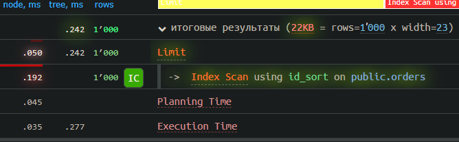

# Анализ использования индексов в данном проекте на основе 1000 запросов каждого вида
**Запуск анализа:**  
```sh
cd explain
./explain_up.sh
# Выбрать вид запроса в explain.go и запустить
make explain
./explain_down.sh
```

***Планировщик запросов Postgresql считает, что запрос с LIMIT не стоит
использовать в качестве индекса, поскольку последовательное сканирование обходится дешевле.
Стоимость индексного чтения страницы в 4 раза превышает стоимость последовательного чтения страницы.
Индекс на булевое значение, не увеличит скорость.***
## Индексы используемые для тестирования:
```sql
CREATE INDEX user_id_hash ON orders using hash(user_id);
CREATE INDEX storage_until_b_tree ON orders (storage_until DESC);
```

***Также было замечено отсутствие выгоды от испольования Hash индекса вместо B-Tree***  
**Я решил, что использовать индексы в данном случае не целесообразно, т.к в основном
Оператор ПВЗ будет выдавать и принимать заказы намного чаще чем выводить список**

## Insert
```
Insert on public.orders  (cost=0.00..0.01 rows=0 width=0) (actual time=0.023..0.023 rows=0 loops=1)
->  Result  (cost=0.00..0.01 rows=1 width=1566) (actual time=0.001..0.001 rows=1 loops=1)
Output: '993'::character varying(255), '1'::character varying(255), '2077-07-07 01:45:11.743128+03'::timest
amp with time zone, false, '2028-08-08 12:32:19.743128+03'::timestamp with time zone, false, 'qwertyuiopasdfghjklyuasdfghjkzxcvbnm'::character varying(255)
Planning Time: 0.024 ms
Execution Time: 0.033 ms
Insert on public.orders  (cost=0.00..0.01 rows=0 width=0) (actual time=0.028..0.028 rows=0 loops=1)
->  Result  (cost=0.00..0.01 rows=1 width=1566) (actual time=0.001..0.001 rows=1 loops=1)
Output: '994'::character varying(255), '1'::character varying(255), '2077-07-07 01:45:11.743128+03'::timest
amp with time zone, false, '2028-08-08 12:32:19.743128+03'::timestamp with time zone, false, 'qwertyuiopasdfghjklyuasdfghjkzxcvbnm'::character varying(255)
Planning Time: 0.029 ms
Execution Time: 0.042 ms
Insert on public.orders  (cost=0.00..0.01 rows=0 width=0) (actual time=0.112..0.112 rows=0 loops=1)
->  Result  (cost=0.00..0.01 rows=1 width=1566) (actual time=0.001..0.001 rows=1 loops=1)
Output: '995'::character varying(255), '1'::character varying(255), '2077-07-07 01:45:11.743128+03'::timest
amp with time zone, false, '2028-08-08 12:32:19.743128+03'::timestamp with time zone, false, 'qwertyuiopasdfghjklyuasdfghjkzxcvbnm'::character varying(255)
Planning Time: 0.028 ms
Execution Time: 0.123 ms
Insert on public.orders  (cost=0.00..0.01 rows=0 width=0) (actual time=0.027..0.027 rows=0 loops=1)
->  Result  (cost=0.00..0.01 rows=1 width=1566) (actual time=0.001..0.001 rows=1 loops=1)
Output: '996'::character varying(255), '1'::character varying(255), '2077-07-07 01:45:11.743128+03'::timest
amp with time zone, false, '2028-08-08 12:32:19.743128+03'::timestamp with time zone, false, 'qwertyuiopasdfghjklyuasdfghjkzxcvbnm'::character varying(255)
Planning Time: 0.028 ms
Execution Time: 0.039 ms
Insert on public.orders  (cost=0.00..0.01 rows=0 width=0) (actual time=0.021..0.021 rows=0 loops=1)
->  Result  (cost=0.00..0.01 rows=1 width=1566) (actual time=0.001..0.001 rows=1 loops=1)
Output: '997'::character varying(255), '1'::character varying(255), '2077-07-07 01:45:11.743128+03'::timest
amp with time zone, false, '2028-08-08 12:32:19.743128+03'::timestamp with time zone, false, 'qwertyuiopasdfghjklyuasdfghjkzxcvbnm'::character varying(255)
Planning Time: 0.024 ms
Execution Time: 0.030 ms
Insert on public.orders  (cost=0.00..0.01 rows=0 width=0) (actual time=0.035..0.035 rows=0 loops=1)
->  Result  (cost=0.00..0.01 rows=1 width=1566) (actual time=0.001..0.001 rows=1 loops=1)
Output: '998'::character varying(255), '1'::character varying(255), '2077-07-07 01:45:11.743128+03'::timest
amp with time zone, false, '2028-08-08 12:32:19.743128+03'::timestamp with time zone, false, 'qwertyuiopasdfghjklyuasdfghjkzxcvbnm'::character varying(255)
Planning Time: 0.034 ms
Execution Time: 0.047 ms
Insert on public.orders  (cost=0.00..0.01 rows=0 width=0) (actual time=0.029..0.029 rows=0 loops=1)
->  Result  (cost=0.00..0.01 rows=1 width=1566) (actual time=0.001..0.001 rows=1 loops=1)
Output: '999'::character varying(255), '1'::character varying(255), '2077-07-07 01:45:11.743128+03'::timest
amp with time zone, false, '2028-08-08 12:32:19.743128+03'::timestamp with time zone, false, 'qwertyuiopasdfghjklyuasdfghjkzxcvbnm'::character varying(255)
Planning Time: 0.029 ms
Execution Time: 0.040 ms
Insert on public.orders  (cost=0.00..0.01 rows=0 width=0) (actual time=0.031..0.031 rows=0 loops=1)
->  Result  (cost=0.00..0.01 rows=1 width=1566) (actual time=0.001..0.001 rows=1 loops=1)
Output: '1000'::character varying(255), '1'::character varying(255), '2077-07-07 01:45:11.743128+03'::times
tamp with time zone, false, '2028-08-08 12:32:19.743128+03'::timestamp with time zone, false, 'qwertyuiopasdfghjklyuasdfghjkzxcvbnm'::character varying(255)
Planning Time: 0.032 ms
Execution Time: 0.042 ms
```

Median Preparation Time: 0.03 ms
Median Execution Time: 0.04 ms

## Insert with index

```
Insert on public.orders  (cost=0.00..0.01 rows=0 width=0) (actual time=0.041..0.041 rows=0 loops=1)
  ->  Result  (cost=0.00..0.01 rows=1 width=1566) (actual time=0.001..0.001 rows=1 loops=1)
        Output: '981'::character varying(255), '1'::character varying(255), '2077-07-07 01:45:11.743128+03'::timestamp with time zone, false, '2028-08-08 12:32:19.743128+03'::timestamp with time zone, false, 'qwertyuiopasdfghjklyuasdfghjkzxcvbnm'::character varying(255)
Planning Time: 0.031 ms
Execution Time: 0.053 ms
Insert on public.orders  (cost=0.00..0.01 rows=0 width=0) (actual time=0.030..0.030 rows=0 loops=1)
  ->  Result  (cost=0.00..0.01 rows=1 width=1566) (actual time=0.001..0.001 rows=1 loops=1)
        Output: '982'::character varying(255), '1'::character varying(255), '2077-07-07 01:45:11.743128+03'::timestamp with time zone, false, '2028-08-08 12:32:19.743128+03'::timestamp with time zone, false, 'qwertyuiopasdfghjklyuasdfghjkzxcvbnm'::character varying(255)
Planning Time: 0.025 ms
Execution Time: 0.040 ms
Insert on public.orders  (cost=0.00..0.01 rows=0 width=0) (actual time=0.043..0.043 rows=0 loops=1)
  ->  Result  (cost=0.00..0.01 rows=1 width=1566) (actual time=0.001..0.001 rows=1 loops=1)
        Output: '990'::character varying(255), '1'::character varying(255), '2077-07-07 01:45:11.743128+03'::timestamp with time zone, false, '2028-08-08 12:32:19.743128+03'::timestamp with time zone, false, 'qwertyuiopasdfghjklyuasdfghjkzxcvbnm'::character varying(255)
Planning Time: 0.032 ms
Execution Time: 0.056 ms
Insert on public.orders  (cost=0.00..0.01 rows=0 width=0) (actual time=0.034..0.034 rows=0 loops=1)
  ->  Result  (cost=0.00..0.01 rows=1 width=1566) (actual time=0.001..0.001 rows=1 loops=1)
        Output: '991'::character varying(255), '1'::character varying(255), '2077-07-07 01:45:11.743128+03'::timestamp with time zone, false, '2028-08-08 12:32:19.743128+03'::timestamp with time zone, false, 'qwertyuiopasdfghjklyuasdfghjkzxcvbnm'::character varying(255)
Planning Time: 0.025 ms
Execution Time: 0.045 ms
Insert on public.orders  (cost=0.00..0.01 rows=0 width=0) (actual time=0.040..0.040 rows=0 loops=1)
  ->  Result  (cost=0.00..0.01 rows=1 width=1566) (actual time=0.001..0.001 rows=1 loops=1)
        Output: '992'::character varying(255), '1'::character varying(255), '2077-07-07 01:45:11.743128+03'::timestamp with time zone, false, '2028-08-08 12:32:19.743128+03'::timestamp with time zone, false, 'qwertyuiopasdfghjklyuasdfghjkzxcvbnm'::character varying(255)
Planning Time: 0.029 ms
Execution Time: 0.052 ms
Insert on public.orders  (cost=0.00..0.01 rows=0 width=0) (actual time=0.030..0.030 rows=0 loops=1)
  ->  Result  (cost=0.00..0.01 rows=1 width=1566) (actual time=0.001..0.001 rows=1 loops=1)
        Output: '993'::character varying(255), '1'::character varying(255), '2077-07-07 01:45:11.743128+03'::timestamp with time zone, false, '2028-08-08 12:32:19.743128+03'::timestamp with time zone, false, 'qwertyuiopasdfghjklyuasdfghjkzxcvbnm'::character varying(255)
Planning Time: 0.029 ms
Execution Time: 0.040 ms
Insert on public.orders  (cost=0.00..0.01 rows=0 width=0) (actual time=0.040..0.040 rows=0 loops=1)
  ->  Result  (cost=0.00..0.01 rows=1 width=1566) (actual time=0.001..0.001 rows=1 loops=1)
        Output: '994'::character varying(255), '1'::character varying(255), '2077-07-07 01:45:11.743128+03'::timestamp with time zone, false, '2028-08-08 12:32:19.743128+03'::timestamp with time zone, false, 'qwertyuiopasdfghjklyuasdfghjkzxcvbnm'::character varying(255)
Planning Time: 0.032 ms
Execution Time: 0.054 ms
Insert on public.orders  (cost=0.00..0.01 rows=0 width=0) (actual time=0.106..0.106 rows=0 loops=1)
  ->  Result  (cost=0.00..0.01 rows=1 width=1566) (actual time=0.002..0.002 rows=1 loops=1)
        Output: '995'::character varying(255), '1'::character varying(255), '2077-07-07 01:45:11.743128+03'::timestamp with time zone, false, '2028-08-08 12:32:19.743128+03'::timestamp with time zone, false, 'qwertyuiopasdfghjklyuasdfghjkzxcvbnm'::character varying(255)
Planning Time: 0.037 ms
Execution Time: 0.122 ms
Insert on public.orders  (cost=0.00..0.01 rows=0 width=0) (actual time=0.034..0.035 rows=0 loops=1)
  ->  Result  (cost=0.00..0.01 rows=1 width=1566) (actual time=0.001..0.001 rows=1 loops=1)
        Output: '998'::character varying(255), '1'::character varying(255), '2077-07-07 01:45:11.743128+03'::timestamp with time zone, false, '2028-08-08 12:32:19.743128+03'::timestamp with time zone, false, 'qwertyuiopasdfghjklyuasdfghjkzxcvbnm'::character varying(255)
Planning Time: 0.027 ms
Execution Time: 0.045 ms
Insert on public.orders  (cost=0.00..0.01 rows=0 width=0) (actual time=0.038..0.038 rows=0 loops=1)
  ->  Result  (cost=0.00..0.01 rows=1 width=1566) (actual time=0.001..0.001 rows=1 loops=1)
        Output: '999'::character varying(255), '1'::character varying(255), '2077-07-07 01:45:11.743128+03'::timestamp with time zone, false, '2028-08-08 12:32:19.743128+03'::timestamp with time zone, false, 'qwertyuiopasdfghjklyuasdfghjkzxcvbnm'::character varying(255)
Planning Time: 0.029 ms
Execution Time: 0.049 ms
Insert on public.orders  (cost=0.00..0.01 rows=0 width=0) (actual time=0.045..0.045 rows=0 loops=1)
  ->  Result  (cost=0.00..0.01 rows=1 width=1566) (actual time=0.001..0.001 rows=1 loops=1)
        Output: '1000'::character varying(255), '1'::character varying(255), '2077-07-07 01:45:11.743128+03'::timestamp with time zone, false, '2028-08-08 12:32:19.743128+03'::timestamp with time zone, false, 'qwertyuiopasdfghjklyuasdfghjkzxcvbnm'::character varying(255)
Planning Time: 0.031 ms
Execution Time: 0.057 ms
```

Median Preparation Time: 0.03 ms
Median Execution Time: 0.06 ms


--------------------------------------------------
## Update
```
Update on public.orders  (cost=0.27..8.29 rows=0 width=0) (actual time=0.066..0.066 rows=0 loops=1)
  ->  Index Scan using orders_pkey on public.orders  (cost=0.27..8.29 rows=1 width=16) (actual time=0.036..0.038 rows=1 loops=1)
        Output: false, '2028-08-08 12:32:19.743128+03'::timestamp with time zone, false, ctid
        Index Cond: ((orders.id)::text = '973'::text)
Planning Time: 0.099 ms
Execution Time: 0.103 ms
Update on public.orders  (cost=0.27..8.29 rows=0 width=0) (actual time=0.056..0.056 rows=0 loops=1)
  ->  Index Scan using orders_pkey on public.orders  (cost=0.27..8.29 rows=1 width=16) (actual time=0.038..0.039 rows=1 loops=1)
        Output: false, '2028-08-08 12:32:19.743128+03'::timestamp with time zone, false, ctid
        Index Cond: ((orders.id)::text = '974'::text)
Planning Time: 0.080 ms
Execution Time: 0.083 ms
Update on public.orders  (cost=0.27..8.29 rows=0 width=0) (actual time=0.047..0.048 rows=0 loops=1)
  ->  Index Scan using orders_pkey on public.orders  (cost=0.27..8.29 rows=1 width=16) (actual time=0.029..0.030 rows=1 loops=1)
        Output: false, '2028-08-08 12:32:19.743128+03'::timestamp with time zone, false, ctid
        Index Cond: ((orders.id)::text = '975'::text)
Planning Time: 0.068 ms
Execution Time: 0.070 ms
Update on public.orders  (cost=0.27..8.29 rows=0 width=0) (actual time=0.047..0.047 rows=0 loops=1)
  ->  Index Scan using orders_pkey on public.orders  (cost=0.27..8.29 rows=1 width=16) (actual time=0.031..0.032 rows=1 loops=1)
        Output: false, '2028-08-08 12:32:19.743128+03'::timestamp with time zone, false, ctid
        Index Cond: ((orders.id)::text = '976'::text)
Planning Time: 0.070 ms
Execution Time: 0.066 ms
Update on public.orders  (cost=0.27..8.29 rows=0 width=0) (actual time=0.041..0.042 rows=0 loops=1)
  ->  Index Scan using orders_pkey on public.orders  (cost=0.27..8.29 rows=1 width=16) (actual time=0.027..0.028 rows=1 loops=1)
        Output: false, '2028-08-08 12:32:19.743128+03'::timestamp with time zone, false, ctid
        Index Cond: ((orders.id)::text = '977'::text)
Planning Time: 0.060 ms
Execution Time: 0.059 ms
Update on public.orders  (cost=0.27..8.29 rows=0 width=0) (actual time=0.056..0.057 rows=0 loops=1)
  ->  Index Scan using orders_pkey on public.orders  (cost=0.27..8.29 rows=1 width=16) (actual time=0.037..0.038 rows=1 loops=1)
        Output: false, '2028-08-08 12:32:19.743128+03'::timestamp with time zone, false, ctid
        Index Cond: ((orders.id)::text = '978'::text)
Planning Time: 0.067 ms
Execution Time: 0.077 ms
Update on public.orders  (cost=0.27..8.29 rows=0 width=0) (actual time=0.056..0.056 rows=0 loops=1)
  ->  Index Scan using orders_pkey on public.orders  (cost=0.27..8.29 rows=1 width=16) (actual time=0.037..0.038 rows=1 loops=1)
        Output: false, '2028-08-08 12:32:19.743128+03'::timestamp with time zone, false, ctid
        Index Cond: ((orders.id)::text = '979'::text)
Planning Time: 0.075 ms
Execution Time: 0.077 ms
Update on public.orders  (cost=0.27..8.29 rows=0 width=0) (actual time=0.069..0.069 rows=0 loops=1)
  ->  Index Scan using orders_pkey on public.orders  (cost=0.27..8.29 rows=1 width=16) (actual time=0.044..0.046 rows=1 loops=1)
        Output: false, '2028-08-08 12:32:19.743128+03'::timestamp with time zone, false, ctid
        Index Cond: ((orders.id)::text = '980'::text)
Planning Time: 0.100 ms
Execution Time: 0.098 ms
Update on public.orders  (cost=0.27..8.29 rows=0 width=0) (actual time=0.088..0.088 rows=0 loops=1)
  ->  Index Scan using orders_pkey on public.orders  (cost=0.27..8.29 rows=1 width=16) (actual time=0.053..0.055 rows=1 loops=1)
        Output: false, '2028-08-08 12:32:19.743128+03'::timestamp with time zone, false, ctid
        Index Cond: ((orders.id)::text = '981'::text)
Planning Time: 0.110 ms
Execution Time: 0.120 ms
Update on public.orders  (cost=0.27..8.29 rows=0 width=0) (actual time=0.085..0.086 rows=0 loops=1)
  ->  Index Scan using orders_pkey on public.orders  (cost=0.27..8.29 rows=1 width=16) (actual time=0.056..0.058 rows=1 loops=1)
        Output: false, '2028-08-08 12:32:19.743128+03'::timestamp with time zone, false, ctid
        Index Cond: ((orders.id)::text = '982'::text)
Planning Time: 0.131 ms
Execution Time: 0.117 ms
Update on public.orders  (cost=0.27..8.29 rows=0 width=0) (actual time=0.075..0.076 rows=0 loops=1)
  ->  Index Scan using orders_pkey on public.orders  (cost=0.27..8.29 rows=1 width=16) (actual time=0.047..0.050 rows=1 loops=1)
        Output: false, '2028-08-08 12:32:19.743128+03'::timestamp with time zone, false, ctid
        Index Cond: ((orders.id)::text = '983'::text)
Planning Time: 0.109 ms
Execution Time: 0.103 ms
Update on public.orders  (cost=0.27..8.29 rows=0 width=0) (actual time=0.104..0.104 rows=0 loops=1)
  ->  Index Scan using orders_pkey on public.orders  (cost=0.27..8.29 rows=1 width=16) (actual time=0.084..0.086 rows=1 loops=1)
        Output: false, '2028-08-08 12:32:19.743128+03'::timestamp with time zone, false, ctid
        Index Cond: ((orders.id)::text = '984'::text)
Planning Time: 0.129 ms
Execution Time: 0.130 ms
Update on public.orders  (cost=0.27..8.29 rows=0 width=0) (actual time=0.085..0.085 rows=0 loops=1)
  ->  Index Scan using orders_pkey on public.orders  (cost=0.27..8.29 rows=1 width=16) (actual time=0.057..0.059 rows=1 loops=1)
        Output: false, '2028-08-08 12:32:19.743128+03'::timestamp with time zone, false, ctid
        Index Cond: ((orders.id)::text = '985'::text)
Planning Time: 0.104 ms
Execution Time: 0.122 ms
Update on public.orders  (cost=0.27..8.29 rows=0 width=0) (actual time=0.061..0.061 rows=0 loops=1)
  ->  Index Scan using orders_pkey on public.orders  (cost=0.27..8.29 rows=1 width=16) (actual time=0.043..0.044 rows=1 loops=1)
        Output: false, '2028-08-08 12:32:19.743128+03'::timestamp with time zone, false, ctid
        Index Cond: ((orders.id)::text = '986'::text)
Planning Time: 0.077 ms
Execution Time: 0.084 ms
Update on public.orders  (cost=0.27..8.29 rows=0 width=0) (actual time=0.054..0.055 rows=0 loops=1)
  ->  Index Scan using orders_pkey on public.orders  (cost=0.27..8.29 rows=1 width=16) (actual time=0.034..0.036 rows=1 loops=1)
        Output: false, '2028-08-08 12:32:19.743128+03'::timestamp with time zone, false, ctid
        Index Cond: ((orders.id)::text = '987'::text)
Planning Time: 0.066 ms
Execution Time: 0.075 ms
Update on public.orders  (cost=0.27..8.29 rows=0 width=0) (actual time=0.046..0.046 rows=0 loops=1)
  ->  Index Scan using orders_pkey on public.orders  (cost=0.27..8.29 rows=1 width=16) (actual time=0.029..0.031 rows=1 loops=1)
        Output: false, '2028-08-08 12:32:19.743128+03'::timestamp with time zone, false, ctid
        Index Cond: ((orders.id)::text = '988'::text)
Planning Time: 0.062 ms
Execution Time: 0.067 ms
Update on public.orders  (cost=0.27..8.29 rows=0 width=0) (actual time=0.047..0.047 rows=0 loops=1)
  ->  Index Scan using orders_pkey on public.orders  (cost=0.27..8.29 rows=1 width=16) (actual time=0.031..0.033 rows=1 loops=1)
        Output: false, '2028-08-08 12:32:19.743128+03'::timestamp with time zone, false, ctid
        Index Cond: ((orders.id)::text = '989'::text)
Planning Time: 0.056 ms
Execution Time: 0.064 ms
Update on public.orders  (cost=0.27..8.29 rows=0 width=0) (actual time=0.096..0.096 rows=0 loops=1)
  ->  Index Scan using orders_pkey on public.orders  (cost=0.27..8.29 rows=1 width=16) (actual time=0.078..0.080 rows=1 loops=1)
        Output: false, '2028-08-08 12:32:19.743128+03'::timestamp with time zone, false, ctid
        Index Cond: ((orders.id)::text = '990'::text)
Planning Time: 0.073 ms
Execution Time: 0.118 ms
Update on public.orders  (cost=0.27..8.29 rows=0 width=0) (actual time=0.040..0.040 rows=0 loops=1)
  ->  Index Scan using orders_pkey on public.orders  (cost=0.27..8.29 rows=1 width=16) (actual time=0.023..0.024 rows=1 loops=1)
        Output: false, '2028-08-08 12:32:19.743128+03'::timestamp with time zone, false, ctid
        Index Cond: ((orders.id)::text = '991'::text)
Planning Time: 0.055 ms
Execution Time: 0.055 ms
Update on public.orders  (cost=0.27..8.29 rows=0 width=0) (actual time=0.048..0.048 rows=0 loops=1)
  ->  Index Scan using orders_pkey on public.orders  (cost=0.27..8.29 rows=1 width=16) (actual time=0.032..0.033 rows=1 loops=1)
        Output: false, '2028-08-08 12:32:19.743128+03'::timestamp with time zone, false, ctid
        Index Cond: ((orders.id)::text = '992'::text)
Planning Time: 0.062 ms
Execution Time: 0.068 ms
Update on public.orders  (cost=0.27..8.29 rows=0 width=0) (actual time=0.043..0.044 rows=0 loops=1)
  ->  Index Scan using orders_pkey on public.orders  (cost=0.27..8.29 rows=1 width=16) (actual time=0.028..0.030 rows=1 loops=1)
        Output: false, '2028-08-08 12:32:19.743128+03'::timestamp with time zone, false, ctid
        Index Cond: ((orders.id)::text = '993'::text)
Planning Time: 0.063 ms
Execution Time: 0.062 ms
Update on public.orders  (cost=0.27..8.29 rows=0 width=0) (actual time=0.039..0.039 rows=0 loops=1)
  ->  Index Scan using orders_pkey on public.orders  (cost=0.27..8.29 rows=1 width=16) (actual time=0.025..0.026 rows=1 loops=1)
        Output: false, '2028-08-08 12:32:19.743128+03'::timestamp with time zone, false, ctid
        Index Cond: ((orders.id)::text = '994'::text)
Planning Time: 0.054 ms
Execution Time: 0.054 ms
Update on public.orders  (cost=0.27..8.29 rows=0 width=0) (actual time=0.036..0.037 rows=0 loops=1)
  ->  Index Scan using orders_pkey on public.orders  (cost=0.27..8.29 rows=1 width=16) (actual time=0.024..0.025 rows=1 loops=1)
        Output: false, '2028-08-08 12:32:19.743128+03'::timestamp with time zone, false, ctid
        Index Cond: ((orders.id)::text = '995'::text)
Planning Time: 0.045 ms
Execution Time: 0.050 ms
Update on public.orders  (cost=0.27..8.29 rows=0 width=0) (actual time=0.036..0.037 rows=0 loops=1)
  ->  Index Scan using orders_pkey on public.orders  (cost=0.27..8.29 rows=1 width=16) (actual time=0.023..0.024 rows=1 loops=1)
        Output: false, '2028-08-08 12:32:19.743128+03'::timestamp with time zone, false, ctid
        Index Cond: ((orders.id)::text = '996'::text)
Planning Time: 0.050 ms
Execution Time: 0.051 ms
Update on public.orders  (cost=0.27..8.29 rows=0 width=0) (actual time=0.068..0.069 rows=0 loops=1)
  ->  Index Scan using orders_pkey on public.orders  (cost=0.27..8.29 rows=1 width=16) (actual time=0.046..0.048 rows=1 loops=1)
        Output: false, '2028-08-08 12:32:19.743128+03'::timestamp with time zone, false, ctid
        Index Cond: ((orders.id)::text = '997'::text)
Planning Time: 0.143 ms
Execution Time: 0.102 ms
Update on public.orders  (cost=0.27..8.29 rows=0 width=0) (actual time=0.047..0.047 rows=0 loops=1)
  ->  Index Scan using orders_pkey on public.orders  (cost=0.27..8.29 rows=1 width=16) (actual time=0.032..0.033 rows=1 loops=1)
        Output: false, '2028-08-08 12:32:19.743128+03'::timestamp with time zone, false, ctid
        Index Cond: ((orders.id)::text = '998'::text)
Planning Time: 0.064 ms
Execution Time: 0.067 ms
Update on public.orders  (cost=0.27..8.29 rows=0 width=0) (actual time=0.049..0.049 rows=0 loops=1)
  ->  Index Scan using orders_pkey on public.orders  (cost=0.27..8.29 rows=1 width=16) (actual time=0.032..0.033 rows=1 loops=1)
        Output: false, '2028-08-08 12:32:19.743128+03'::timestamp with time zone, false, ctid
        Index Cond: ((orders.id)::text = '999'::text)
Planning Time: 0.075 ms
Execution Time: 0.069 ms
Update on public.orders  (cost=0.27..8.29 rows=0 width=0) (actual time=0.040..0.040 rows=0 loops=1)
  ->  Index Scan using orders_pkey on public.orders  (cost=0.27..8.29 rows=1 width=16) (actual time=0.026..0.027 rows=1 loops=1)
        Output: false, '2028-08-08 12:32:19.743128+03'::timestamp with time zone, false, ctid
        Index Cond: ((orders.id)::text = '1000'::text)
Planning Time: 0.057 ms
Execution Time: 0.056 ms
```

Median Preparation Time: 0.06 ms
Median Execution Time: 0.06 ms

## Update with index

```
Update on public.orders  (cost=0.27..8.29 rows=0 width=0) (actual time=0.037..0.038 rows=0 loops=1)
  ->  Index Scan using orders_pkey on public.orders  (cost=0.27..8.29 rows=1 width=16) (actual time=0.024..0.025 rows=1 loops=1)
        Output: false, '2028-08-08 12:32:19.743128+03'::timestamp with time zone, false, ctid
        Index Cond: ((orders.id)::text = '981'::text)
Planning Time: 0.046 ms
Execution Time: 0.051 ms
Update on public.orders  (cost=0.27..8.29 rows=0 width=0) (actual time=0.069..0.070 rows=0 loops=1)
  ->  Index Scan using orders_pkey on public.orders  (cost=0.27..8.29 rows=1 width=16) (actual time=0.047..0.048 rows=1 loops=1)
        Output: false, '2028-08-08 12:32:19.743128+03'::timestamp with time zone, false, ctid
        Index Cond: ((orders.id)::text = '982'::text)
Planning Time: 0.100 ms
Execution Time: 0.099 ms
Update on public.orders  (cost=0.27..8.29 rows=0 width=0) (actual time=0.052..0.052 rows=0 loops=1)
  ->  Index Scan using orders_pkey on public.orders  (cost=0.27..8.29 rows=1 width=16) (actual time=0.034..0.036 rows=1 loops=1)
        Output: false, '2028-08-08 12:32:19.743128+03'::timestamp with time zone, false, ctid
        Index Cond: ((orders.id)::text = '983'::text)
Planning Time: 0.069 ms
Execution Time: 0.073 ms
Update on public.orders  (cost=0.27..8.29 rows=0 width=0) (actual time=0.040..0.041 rows=0 loops=1)
  ->  Index Scan using orders_pkey on public.orders  (cost=0.27..8.29 rows=1 width=16) (actual time=0.026..0.027 rows=1 loops=1)
        Output: false, '2028-08-08 12:32:19.743128+03'::timestamp with time zone, false, ctid
        Index Cond: ((orders.id)::text = '984'::text)
Planning Time: 0.057 ms
Execution Time: 0.082 ms
Update on public.orders  (cost=0.27..8.29 rows=0 width=0) (actual time=0.050..0.050 rows=0 loops=1)
  ->  Index Scan using orders_pkey on public.orders  (cost=0.27..8.29 rows=1 width=16) (actual time=0.029..0.031 rows=1 loops=1)
        Output: false, '2028-08-08 12:32:19.743128+03'::timestamp with time zone, false, ctid
        Index Cond: ((orders.id)::text = '985'::text)
Planning Time: 0.063 ms
Execution Time: 0.071 ms
Update on public.orders  (cost=0.27..8.29 rows=0 width=0) (actual time=0.036..0.036 rows=0 loops=1)
  ->  Index Scan using orders_pkey on public.orders  (cost=0.27..8.29 rows=1 width=16) (actual time=0.023..0.023 rows=1 loops=1)
        Output: false, '2028-08-08 12:32:19.743128+03'::timestamp with time zone, false, ctid
        Index Cond: ((orders.id)::text = '986'::text)
Planning Time: 0.058 ms
Execution Time: 0.051 ms
Update on public.orders  (cost=0.27..8.29 rows=0 width=0) (actual time=0.040..0.040 rows=0 loops=1)
  ->  Index Scan using orders_pkey on public.orders  (cost=0.27..8.29 rows=1 width=16) (actual time=0.026..0.026 rows=1 loops=1)
        Output: false, '2028-08-08 12:32:19.743128+03'::timestamp with time zone, false, ctid
        Index Cond: ((orders.id)::text = '987'::text)
Planning Time: 0.048 ms
Execution Time: 0.056 ms
Update on public.orders  (cost=0.27..8.29 rows=0 width=0) (actual time=0.042..0.042 rows=0 loops=1)
  ->  Index Scan using orders_pkey on public.orders  (cost=0.27..8.29 rows=1 width=16) (actual time=0.027..0.028 rows=1 loops=1)
        Output: false, '2028-08-08 12:32:19.743128+03'::timestamp with time zone, false, ctid
        Index Cond: ((orders.id)::text = '988'::text)
Planning Time: 0.057 ms
Execution Time: 0.062 ms
Update on public.orders  (cost=0.27..8.29 rows=0 width=0) (actual time=0.042..0.042 rows=0 loops=1)
  ->  Index Scan using orders_pkey on public.orders  (cost=0.27..8.29 rows=1 width=16) (actual time=0.027..0.028 rows=1 loops=1)
        Output: false, '2028-08-08 12:32:19.743128+03'::timestamp with time zone, false, ctid
        Index Cond: ((orders.id)::text = '989'::text)
Planning Time: 0.057 ms
Execution Time: 0.060 ms
Update on public.orders  (cost=0.27..8.29 rows=0 width=0) (actual time=0.063..0.063 rows=0 loops=1)
  ->  Index Scan using orders_pkey on public.orders  (cost=0.27..8.29 rows=1 width=16) (actual time=0.048..0.049 rows=1 loops=1)
        Output: false, '2028-08-08 12:32:19.743128+03'::timestamp with time zone, false, ctid
        Index Cond: ((orders.id)::text = '990'::text)
Planning Time: 0.059 ms
Execution Time: 0.079 ms
Update on public.orders  (cost=0.27..8.29 rows=0 width=0) (actual time=0.036..0.036 rows=0 loops=1)
  ->  Index Scan using orders_pkey on public.orders  (cost=0.27..8.29 rows=1 width=16) (actual time=0.024..0.024 rows=1 loops=1)
        Output: false, '2028-08-08 12:32:19.743128+03'::timestamp with time zone, false, ctid
        Index Cond: ((orders.id)::text = '991'::text)
Planning Time: 0.048 ms
Execution Time: 0.050 ms
Update on public.orders  (cost=0.27..8.29 rows=0 width=0) (actual time=0.039..0.039 rows=0 loops=1)
  ->  Index Scan using orders_pkey on public.orders  (cost=0.27..8.29 rows=1 width=16) (actual time=0.025..0.026 rows=1 loops=1)
        Output: false, '2028-08-08 12:32:19.743128+03'::timestamp with time zone, false, ctid
        Index Cond: ((orders.id)::text = '992'::text)
Planning Time: 0.102 ms
Execution Time: 0.055 ms
Update on public.orders  (cost=0.27..8.29 rows=0 width=0) (actual time=0.050..0.050 rows=0 loops=1)
  ->  Index Scan using orders_pkey on public.orders  (cost=0.27..8.29 rows=1 width=16) (actual time=0.031..0.032 rows=1 loops=1)
        Output: false, '2028-08-08 12:32:19.743128+03'::timestamp with time zone, false, ctid
        Index Cond: ((orders.id)::text = '993'::text)
Planning Time: 0.062 ms
Execution Time: 0.069 ms
Update on public.orders  (cost=0.27..8.29 rows=0 width=0) (actual time=0.037..0.038 rows=0 loops=1)
  ->  Index Scan using orders_pkey on public.orders  (cost=0.27..8.29 rows=1 width=16) (actual time=0.024..0.025 rows=1 loops=1)
        Output: false, '2028-08-08 12:32:19.743128+03'::timestamp with time zone, false, ctid
        Index Cond: ((orders.id)::text = '994'::text)
Planning Time: 0.054 ms
Execution Time: 0.053 ms
Update on public.orders  (cost=0.27..8.29 rows=0 width=0) (actual time=0.032..0.032 rows=0 loops=1)
  ->  Index Scan using orders_pkey on public.orders  (cost=0.27..8.29 rows=1 width=16) (actual time=0.020..0.021 rows=1 loops=1)
        Output: false, '2028-08-08 12:32:19.743128+03'::timestamp with time zone, false, ctid
        Index Cond: ((orders.id)::text = '995'::text)
Planning Time: 0.043 ms
Execution Time: 0.045 ms
Update on public.orders  (cost=0.27..8.29 rows=0 width=0) (actual time=0.037..0.037 rows=0 loops=1)
  ->  Index Scan using orders_pkey on public.orders  (cost=0.27..8.29 rows=1 width=16) (actual time=0.025..0.026 rows=1 loops=1)
        Output: false, '2028-08-08 12:32:19.743128+03'::timestamp with time zone, false, ctid
        Index Cond: ((orders.id)::text = '996'::text)
Planning Time: 0.054 ms
Execution Time: 0.052 ms
Update on public.orders  (cost=0.27..8.29 rows=0 width=0) (actual time=0.047..0.047 rows=0 loops=1)
  ->  Index Scan using orders_pkey on public.orders  (cost=0.27..8.29 rows=1 width=16) (actual time=0.032..0.034 rows=1 loops=1)
        Output: false, '2028-08-08 12:32:19.743128+03'::timestamp with time zone, false, ctid
        Index Cond: ((orders.id)::text = '997'::text)
Planning Time: 0.064 ms
Execution Time: 0.064 ms
Update on public.orders  (cost=0.27..8.29 rows=0 width=0) (actual time=0.054..0.055 rows=0 loops=1)
  ->  Index Scan using orders_pkey on public.orders  (cost=0.27..8.29 rows=1 width=16) (actual time=0.036..0.037 rows=1 loops=1)
        Output: false, '2028-08-08 12:32:19.743128+03'::timestamp with time zone, false, ctid
        Index Cond: ((orders.id)::text = '998'::text)
Planning Time: 0.084 ms
Execution Time: 0.078 ms
Update on public.orders  (cost=0.27..8.29 rows=0 width=0) (actual time=0.038..0.038 rows=0 loops=1)
  ->  Index Scan using orders_pkey on public.orders  (cost=0.27..8.29 rows=1 width=16) (actual time=0.024..0.025 rows=1 loops=1)
        Output: false, '2028-08-08 12:32:19.743128+03'::timestamp with time zone, false, ctid
        Index Cond: ((orders.id)::text = '999'::text)
Planning Time: 0.049 ms
Execution Time: 0.052 ms
Update on public.orders  (cost=0.27..8.29 rows=0 width=0) (actual time=0.046..0.046 rows=0 loops=1)
  ->  Index Scan using orders_pkey on public.orders  (cost=0.27..8.29 rows=1 width=16) (actual time=0.030..0.031 rows=1 loops=1)
        Output: false, '2028-08-08 12:32:19.743128+03'::timestamp with time zone, false, ctid
        Index Cond: ((orders.id)::text = '1000'::text)
Planning Time: 0.062 ms
Execution Time: 0.065 ms
```

Median Preparation Time: 0.07 ms
Median Execution Time: 0.07 ms


-------------------------------------------------
## Select exists

```
Result  (cost=8.29..8.29 rows=1 width=1) (actual time=0.045..0.046 rows=1 loops=1)
  Output: $0
  InitPlan 1 (returns $0)
    ->  Index Only Scan using orders_pkey on public.orders  (cost=0.27..8.29 rows=1 width=0) (actual time=0.041..0.042 rows=1 loops=1)
          Index Cond: (orders.id = '984'::text)
          Heap Fetches: 1
Planning Time: 0.149 ms
Execution Time: 0.085 ms
Result  (cost=8.29..8.29 rows=1 width=1) (actual time=0.032..0.032 rows=1 loops=1)
  Output: $0
  InitPlan 1 (returns $0)
    ->  Index Only Scan using orders_pkey on public.orders  (cost=0.27..8.29 rows=1 width=0) (actual time=0.030..0.030 rows=1 loops=1)
          Index Cond: (orders.id = '985'::text)
          Heap Fetches: 1
Planning Time: 0.099 ms
Execution Time: 0.052 ms
Result  (cost=8.29..8.29 rows=1 width=1) (actual time=0.028..0.028 rows=1 loops=1)
  Output: $0
  InitPlan 1 (returns $0)
    ->  Index Only Scan using orders_pkey on public.orders  (cost=0.27..8.29 rows=1 width=0) (actual time=0.026..0.026 rows=1 loops=1)
          Index Cond: (orders.id = '986'::text)
          Heap Fetches: 1
Planning Time: 0.081 ms
Execution Time: 0.044 ms
Result  (cost=8.29..8.29 rows=1 width=1) (actual time=0.017..0.018 rows=1 loops=1)
  Output: $0
  InitPlan 1 (returns $0)
    ->  Index Only Scan using orders_pkey on public.orders  (cost=0.27..8.29 rows=1 width=0) (actual time=0.015..0.016 rows=1 loops=1)
          Index Cond: (orders.id = '987'::text)
          Heap Fetches: 1
Planning Time: 0.053 ms
Execution Time: 0.030 ms
Result  (cost=8.29..8.29 rows=1 width=1) (actual time=0.010..0.011 rows=1 loops=1)
  Output: $0
  InitPlan 1 (returns $0)
    ->  Index Only Scan using orders_pkey on public.orders  (cost=0.27..8.29 rows=1 width=0) (actual time=0.010..0.010 rows=1 loops=1)
          Index Cond: (orders.id = '988'::text)
          Heap Fetches: 1
Planning Time: 0.035 ms
Execution Time: 0.020 ms
Result  (cost=8.29..8.29 rows=1 width=1) (actual time=0.008..0.008 rows=1 loops=1)
  Output: $0
  InitPlan 1 (returns $0)
    ->  Index Only Scan using orders_pkey on public.orders  (cost=0.27..8.29 rows=1 width=0) (actual time=0.007..0.007 rows=1 loops=1)
          Index Cond: (orders.id = '989'::text)
          Heap Fetches: 1
Planning Time: 0.028 ms
Execution Time: 0.015 ms
Result  (cost=8.29..8.29 rows=1 width=1) (actual time=0.026..0.027 rows=1 loops=1)
  Output: $0
  InitPlan 1 (returns $0)
    ->  Index Only Scan using orders_pkey on public.orders  (cost=0.27..8.29 rows=1 width=0) (actual time=0.024..0.024 rows=1 loops=1)
          Index Cond: (orders.id = '990'::text)
          Heap Fetches: 1
Planning Time: 0.079 ms
Execution Time: 0.043 ms
Result  (cost=8.29..8.29 rows=1 width=1) (actual time=0.039..0.039 rows=1 loops=1)
  Output: $0
  InitPlan 1 (returns $0)
    ->  Index Only Scan using orders_pkey on public.orders  (cost=0.27..8.29 rows=1 width=0) (actual time=0.035..0.036 rows=1 loops=1)
          Index Cond: (orders.id = '991'::text)
          Heap Fetches: 1
Planning Time: 0.138 ms
Execution Time: 0.064 ms
Result  (cost=8.29..8.29 rows=1 width=1) (actual time=0.017..0.018 rows=1 loops=1)
  Output: $0
  InitPlan 1 (returns $0)
    ->  Index Only Scan using orders_pkey on public.orders  (cost=0.27..8.29 rows=1 width=0) (actual time=0.016..0.016 rows=1 loops=1)
          Index Cond: (orders.id = '992'::text)
          Heap Fetches: 1
Planning Time: 0.065 ms
Execution Time: 0.031 ms
Result  (cost=8.29..8.29 rows=1 width=1) (actual time=0.009..0.009 rows=1 loops=1)
  Output: $0
  InitPlan 1 (returns $0)
    ->  Index Only Scan using orders_pkey on public.orders  (cost=0.27..8.29 rows=1 width=0) (actual time=0.008..0.008 rows=1 loops=1)
          Index Cond: (orders.id = '993'::text)
          Heap Fetches: 1
Planning Time: 0.032 ms
Execution Time: 0.017 ms
Result  (cost=8.29..8.29 rows=1 width=1) (actual time=0.009..0.009 rows=1 loops=1)
  Output: $0
  InitPlan 1 (returns $0)
    ->  Index Only Scan using orders_pkey on public.orders  (cost=0.27..8.29 rows=1 width=0) (actual time=0.008..0.008 rows=1 loops=1)
          Index Cond: (orders.id = '994'::text)
          Heap Fetches: 1
Planning Time: 0.049 ms
Execution Time: 0.017 ms
Result  (cost=8.29..8.29 rows=1 width=1) (actual time=0.008..0.008 rows=1 loops=1)
  Output: $0
  InitPlan 1 (returns $0)
    ->  Index Only Scan using orders_pkey on public.orders  (cost=0.27..8.29 rows=1 width=0) (actual time=0.007..0.007 rows=1 loops=1)
          Index Cond: (orders.id = '995'::text)
          Heap Fetches: 1
Planning Time: 0.030 ms
Execution Time: 0.016 ms
Result  (cost=8.29..8.29 rows=1 width=1) (actual time=0.007..0.007 rows=1 loops=1)
  Output: $0
  InitPlan 1 (returns $0)
    ->  Index Only Scan using orders_pkey on public.orders  (cost=0.27..8.29 rows=1 width=0) (actual time=0.006..0.006 rows=1 loops=1)
          Index Cond: (orders.id = '996'::text)
          Heap Fetches: 1
Planning Time: 0.030 ms
Execution Time: 0.015 ms
Result  (cost=8.29..8.29 rows=1 width=1) (actual time=0.010..0.010 rows=1 loops=1)
  Output: $0
  InitPlan 1 (returns $0)
    ->  Index Only Scan using orders_pkey on public.orders  (cost=0.27..8.29 rows=1 width=0) (actual time=0.009..0.009 rows=1 loops=1)
          Index Cond: (orders.id = '997'::text)
          Heap Fetches: 1
Planning Time: 0.036 ms
Execution Time: 0.019 ms
Result  (cost=8.29..8.29 rows=1 width=1) (actual time=0.008..0.008 rows=1 loops=1)
  Output: $0
  InitPlan 1 (returns $0)
    ->  Index Only Scan using orders_pkey on public.orders  (cost=0.27..8.29 rows=1 width=0) (actual time=0.007..0.007 rows=1 loops=1)
          Index Cond: (orders.id = '998'::text)
          Heap Fetches: 1
Planning Time: 0.030 ms
Execution Time: 0.017 ms
Result  (cost=8.29..8.29 rows=1 width=1) (actual time=0.013..0.013 rows=1 loops=1)
  Output: $0
  InitPlan 1 (returns $0)
    ->  Index Only Scan using orders_pkey on public.orders  (cost=0.27..8.29 rows=1 width=0) (actual time=0.011..0.012 rows=1 loops=1)
          Index Cond: (orders.id = '999'::text)
          Heap Fetches: 1
Planning Time: 0.040 ms
Execution Time: 0.024 ms
Result  (cost=8.29..8.29 rows=1 width=1) (actual time=0.013..0.013 rows=1 loops=1)
  Output: $0
  InitPlan 1 (returns $0)
    ->  Index Only Scan using orders_pkey on public.orders  (cost=0.27..8.29 rows=1 width=0) (actual time=0.012..0.012 rows=1 loops=1)
          Index Cond: (orders.id = '1000'::text)
          Heap Fetches: 1
Planning Time: 0.036 ms
Execution Time: 0.023 ms
```

Median Preparation Time: 0.04 ms  
Median Execution Time: 0.02 ms  
  
  


## Select exists with index

```
Result  (cost=8.29..8.29 rows=1 width=1) (actual time=0.048..0.049 rows=1 loops=1)
  Output: $0
  InitPlan 1 (returns $0)
    ->  Index Only Scan using orders_pkey on public.orders  (cost=0.27..8.29 rows=1 width=0) (actual time=0.044..0.044 rows=1 loops=1)
          Index Cond: (orders.id = '975'::text)
          Heap Fetches: 1
Planning Time: 0.169 ms
Execution Time: 0.092 ms
Result  (cost=8.29..8.29 rows=1 width=1) (actual time=0.027..0.027 rows=1 loops=1)
  Output: $0
  InitPlan 1 (returns $0)
    ->  Index Only Scan using orders_pkey on public.orders  (cost=0.27..8.29 rows=1 width=0) (actual time=0.025..0.025 rows=1 loops=1)
          Index Cond: (orders.id = '976'::text)
          Heap Fetches: 1
Planning Time: 0.075 ms
Execution Time: 0.045 ms
Result  (cost=8.29..8.29 rows=1 width=1) (actual time=0.021..0.021 rows=1 loops=1)
  Output: $0
  InitPlan 1 (returns $0)
    ->  Index Only Scan using orders_pkey on public.orders  (cost=0.27..8.29 rows=1 width=0) (actual time=0.019..0.019 rows=1 loops=1)
          Index Cond: (orders.id = '977'::text)
          Heap Fetches: 1
Planning Time: 0.091 ms
Execution Time: 0.040 ms
Result  (cost=8.29..8.29 rows=1 width=1) (actual time=0.032..0.033 rows=1 loops=1)
  Output: $0
  InitPlan 1 (returns $0)
    ->  Index Only Scan using orders_pkey on public.orders  (cost=0.27..8.29 rows=1 width=0) (actual time=0.029..0.029 rows=1 loops=1)
          Index Cond: (orders.id = '978'::text)
          Heap Fetches: 1
Planning Time: 0.095 ms
Execution Time: 0.053 ms
Result  (cost=8.29..8.29 rows=1 width=1) (actual time=0.016..0.016 rows=1 loops=1)
  Output: $0
  InitPlan 1 (returns $0)
    ->  Index Only Scan using orders_pkey on public.orders  (cost=0.27..8.29 rows=1 width=0) (actual time=0.015..0.015 rows=1 loops=1)
          Index Cond: (orders.id = '979'::text)
          Heap Fetches: 1
Planning Time: 0.059 ms
Execution Time: 0.028 ms
Result  (cost=8.29..8.29 rows=1 width=1) (actual time=0.019..0.020 rows=1 loops=1)
  Output: $0
  InitPlan 1 (returns $0)
    ->  Index Only Scan using orders_pkey on public.orders  (cost=0.27..8.29 rows=1 width=0) (actual time=0.018..0.018 rows=1 loops=1)
          Index Cond: (orders.id = '980'::text)
          Heap Fetches: 1
Planning Time: 0.072 ms
Execution Time: 0.035 ms
Result  (cost=8.29..8.29 rows=1 width=1) (actual time=0.024..0.025 rows=1 loops=1)
  Output: $0
  InitPlan 1 (returns $0)
    ->  Index Only Scan using orders_pkey on public.orders  (cost=0.27..8.29 rows=1 width=0) (actual time=0.022..0.022 rows=1 loops=1)
          Index Cond: (orders.id = '981'::text)
          Heap Fetches: 1
Planning Time: 0.084 ms
Execution Time: 0.045 ms
Result  (cost=8.29..8.29 rows=1 width=1) (actual time=0.031..0.032 rows=1 loops=1)
  Output: $0
  InitPlan 1 (returns $0)
    ->  Index Only Scan using orders_pkey on public.orders  (cost=0.27..8.29 rows=1 width=0) (actual time=0.029..0.029 rows=1 loops=1)
          Index Cond: (orders.id = '982'::text)
          Heap Fetches: 1
Planning Time: 0.085 ms
Execution Time: 0.050 ms
Result  (cost=8.29..8.29 rows=1 width=1) (actual time=0.029..0.029 rows=1 loops=1)
  Output: $0
  InitPlan 1 (returns $0)
    ->  Index Only Scan using orders_pkey on public.orders  (cost=0.27..8.29 rows=1 width=0) (actual time=0.027..0.027 rows=1 loops=1)
          Index Cond: (orders.id = '983'::text)
          Heap Fetches: 1
Planning Time: 0.085 ms
Execution Time: 0.052 ms
Result  (cost=8.29..8.29 rows=1 width=1) (actual time=0.018..0.019 rows=1 loops=1)
  Output: $0
  InitPlan 1 (returns $0)
    ->  Index Only Scan using orders_pkey on public.orders  (cost=0.27..8.29 rows=1 width=0) (actual time=0.017..0.017 rows=1 loops=1)
          Index Cond: (orders.id = '984'::text)
          Heap Fetches: 1
Planning Time: 0.056 ms
Execution Time: 0.034 ms
Result  (cost=8.29..8.29 rows=1 width=1) (actual time=0.023..0.023 rows=1 loops=1)
  Output: $0
  InitPlan 1 (returns $0)
    ->  Index Only Scan using orders_pkey on public.orders  (cost=0.27..8.29 rows=1 width=0) (actual time=0.021..0.021 rows=1 loops=1)
          Index Cond: (orders.id = '985'::text)
          Heap Fetches: 1
Planning Time: 0.077 ms
Execution Time: 0.041 ms
Result  (cost=8.29..8.29 rows=1 width=1) (actual time=0.035..0.035 rows=1 loops=1)
  Output: $0
  InitPlan 1 (returns $0)
    ->  Index Only Scan using orders_pkey on public.orders  (cost=0.27..8.29 rows=1 width=0) (actual time=0.031..0.031 rows=1 loops=1)
          Index Cond: (orders.id = '986'::text)
          Heap Fetches: 1
Planning Time: 0.077 ms
Execution Time: 0.057 ms
Result  (cost=8.29..8.29 rows=1 width=1) (actual time=0.028..0.028 rows=1 loops=1)
  Output: $0
  InitPlan 1 (returns $0)
    ->  Index Only Scan using orders_pkey on public.orders  (cost=0.27..8.29 rows=1 width=0) (actual time=0.025..0.026 rows=1 loops=1)
          Index Cond: (orders.id = '987'::text)
          Heap Fetches: 1
Planning Time: 0.098 ms
Execution Time: 0.050 ms
Result  (cost=8.29..8.29 rows=1 width=1) (actual time=0.025..0.026 rows=1 loops=1)
  Output: $0
  InitPlan 1 (returns $0)
    ->  Index Only Scan using orders_pkey on public.orders  (cost=0.27..8.29 rows=1 width=0) (actual time=0.024..0.024 rows=1 loops=1)
          Index Cond: (orders.id = '988'::text)
          Heap Fetches: 1
Planning Time: 0.087 ms
Execution Time: 0.046 ms
Result  (cost=8.29..8.29 rows=1 width=1) (actual time=0.025..0.026 rows=1 loops=1)
  Output: $0
  InitPlan 1 (returns $0)
    ->  Index Only Scan using orders_pkey on public.orders  (cost=0.27..8.29 rows=1 width=0) (actual time=0.023..0.024 rows=1 loops=1)
          Index Cond: (orders.id = '989'::text)
          Heap Fetches: 1
Planning Time: 0.097 ms
Execution Time: 0.045 ms
Result  (cost=8.29..8.29 rows=1 width=1) (actual time=0.034..0.035 rows=1 loops=1)
  Output: $0
  InitPlan 1 (returns $0)
    ->  Index Only Scan using orders_pkey on public.orders  (cost=0.27..8.29 rows=1 width=0) (actual time=0.032..0.032 rows=1 loops=1)
          Index Cond: (orders.id = '990'::text)
          Heap Fetches: 1
Planning Time: 0.102 ms
Execution Time: 0.060 ms
Result  (cost=8.29..8.29 rows=1 width=1) (actual time=0.024..0.025 rows=1 loops=1)
  Output: $0
  InitPlan 1 (returns $0)
    ->  Index Only Scan using orders_pkey on public.orders  (cost=0.27..8.29 rows=1 width=0) (actual time=0.023..0.023 rows=1 loops=1)
          Index Cond: (orders.id = '991'::text)
          Heap Fetches: 1
Planning Time: 0.085 ms
Execution Time: 0.042 ms
Result  (cost=8.29..8.29 rows=1 width=1) (actual time=0.035..0.035 rows=1 loops=1)
  Output: $0
  InitPlan 1 (returns $0)
    ->  Index Only Scan using orders_pkey on public.orders  (cost=0.27..8.29 rows=1 width=0) (actual time=0.032..0.033 rows=1 loops=1)
          Index Cond: (orders.id = '992'::text)
          Heap Fetches: 1
Planning Time: 0.190 ms
Execution Time: 0.065 ms
Result  (cost=8.29..8.29 rows=1 width=1) (actual time=0.050..0.050 rows=1 loops=1)
  Output: $0
  InitPlan 1 (returns $0)
    ->  Index Only Scan using orders_pkey on public.orders  (cost=0.27..8.29 rows=1 width=0) (actual time=0.046..0.046 rows=1 loops=1)
          Index Cond: (orders.id = '993'::text)
          Heap Fetches: 1
Planning Time: 0.135 ms
Execution Time: 0.083 ms
Result  (cost=8.29..8.29 rows=1 width=1) (actual time=0.048..0.048 rows=1 loops=1)
  Output: $0
  InitPlan 1 (returns $0)
    ->  Index Only Scan using orders_pkey on public.orders  (cost=0.27..8.29 rows=1 width=0) (actual time=0.045..0.045 rows=1 loops=1)
          Index Cond: (orders.id = '994'::text)
          Heap Fetches: 1
Planning Time: 0.240 ms
Execution Time: 0.094 ms
Result  (cost=8.29..8.29 rows=1 width=1) (actual time=0.031..0.032 rows=1 loops=1)
  Output: $0
  InitPlan 1 (returns $0)
    ->  Index Only Scan using orders_pkey on public.orders  (cost=0.27..8.29 rows=1 width=0) (actual time=0.029..0.029 rows=1 loops=1)
          Index Cond: (orders.id = '995'::text)
          Heap Fetches: 1
Planning Time: 0.097 ms
Execution Time: 0.054 ms
Result  (cost=8.29..8.29 rows=1 width=1) (actual time=0.019..0.020 rows=1 loops=1)
  Output: $0
  InitPlan 1 (returns $0)
    ->  Index Only Scan using orders_pkey on public.orders  (cost=0.27..8.29 rows=1 width=0) (actual time=0.018..0.018 rows=1 loops=1)
          Index Cond: (orders.id = '996'::text)
          Heap Fetches: 1
Planning Time: 0.067 ms
Execution Time: 0.034 ms
Result  (cost=8.29..8.29 rows=1 width=1) (actual time=0.019..0.019 rows=1 loops=1)
  Output: $0
  InitPlan 1 (returns $0)
    ->  Index Only Scan using orders_pkey on public.orders  (cost=0.27..8.29 rows=1 width=0) (actual time=0.017..0.017 rows=1 loops=1)
          Index Cond: (orders.id = '997'::text)
          Heap Fetches: 1
Planning Time: 0.061 ms
Execution Time: 0.033 ms
Result  (cost=8.29..8.29 rows=1 width=1) (actual time=0.021..0.022 rows=1 loops=1)
  Output: $0
  InitPlan 1 (returns $0)
    ->  Index Only Scan using orders_pkey on public.orders  (cost=0.27..8.29 rows=1 width=0) (actual time=0.019..0.019 rows=1 loops=1)
          Index Cond: (orders.id = '998'::text)
          Heap Fetches: 1
Planning Time: 0.066 ms
Execution Time: 0.040 ms
Result  (cost=8.29..8.29 rows=1 width=1) (actual time=0.024..0.024 rows=1 loops=1)
  Output: $0
  InitPlan 1 (returns $0)
    ->  Index Only Scan using orders_pkey on public.orders  (cost=0.27..8.29 rows=1 width=0) (actual time=0.022..0.022 rows=1 loops=1)
          Index Cond: (orders.id = '999'::text)
          Heap Fetches: 1
Planning Time: 0.076 ms
Execution Time: 0.043 ms
Result  (cost=8.29..8.29 rows=1 width=1) (actual time=0.026..0.026 rows=1 loops=1)
  Output: $0
  InitPlan 1 (returns $0)
    ->  Index Only Scan using orders_pkey on public.orders  (cost=0.27..8.29 rows=1 width=0) (actual time=0.023..0.023 rows=1 loops=1)
          Index Cond: (orders.id = '1000'::text)
          Heap Fetches: 1
Planning Time: 0.093 ms
Execution Time: 0.046 ms
```

Median Preparation Time: 0.07 ms  
Median Execution Time: 0.042 ms  
  
  
  

----------------------------------------------------
## SelectOrders

```
Limit  (cost=13.82..13.83 rows=1 width=1042) (actual time=0.282..0.362 rows=1000 loops=1)
  Output: id, user_id, issued, storage_until, returned
  ->  Sort  (cost=13.82..13.83 rows=1 width=1042) (actual time=0.281..0.312 rows=1000 loops=1)
        Output: id, user_id, issued, storage_until, returned
        Sort Key: orders.storage_until DESC
        Sort Method: quicksort  Memory: 103kB
        ->  Seq Scan on public.orders  (cost=0.00..13.81 rows=1 width=1042) (actual time=0.010..0.158 rows=1000 loops=1)
              Output: id, user_id, issued, storage_until, returned
              Filter: ((NOT orders.issued) AND ((orders.user_id)::text = '1'::text))
Planning Time: 0.063 ms
Execution Time: 0.405 ms
Limit  (cost=13.82..13.83 rows=1 width=1042) (actual time=0.289..0.369 rows=1000 loops=1)
  Output: id, user_id, issued, storage_until, returned
  ->  Sort  (cost=13.82..13.83 rows=1 width=1042) (actual time=0.287..0.318 rows=1000 loops=1)
        Output: id, user_id, issued, storage_until, returned
        Sort Key: orders.storage_until DESC
        Sort Method: quicksort  Memory: 103kB
        ->  Seq Scan on public.orders  (cost=0.00..13.81 rows=1 width=1042) (actual time=0.012..0.163 rows=1000 loops=1)
              Output: id, user_id, issued, storage_until, returned
              Filter: ((NOT orders.issued) AND ((orders.user_id)::text = '1'::text))
Planning Time: 0.094 ms
Execution Time: 0.417 ms
Limit  (cost=13.82..13.83 rows=1 width=1042) (actual time=0.423..0.503 rows=1000 loops=1)
  Output: id, user_id, issued, storage_until, returned
  ->  Sort  (cost=13.82..13.83 rows=1 width=1042) (actual time=0.421..0.452 rows=1000 loops=1)
        Output: id, user_id, issued, storage_until, returned
        Sort Key: orders.storage_until DESC
        Sort Method: quicksort  Memory: 103kB
        ->  Seq Scan on public.orders  (cost=0.00..13.81 rows=1 width=1042) (actual time=0.013..0.215 rows=1000 loops=1)
              Output: id, user_id, issued, storage_until, returned
              Filter: ((NOT orders.issued) AND ((orders.user_id)::text = '1'::text))
Planning Time: 0.100 ms
Execution Time: 0.553 ms
Limit  (cost=13.82..13.83 rows=1 width=1042) (actual time=0.315..0.468 rows=1000 loops=1)
  Output: id, user_id, issued, storage_until, returned
  ->  Sort  (cost=13.82..13.83 rows=1 width=1042) (actual time=0.314..0.417 rows=1000 loops=1)
        Output: id, user_id, issued, storage_until, returned
        Sort Key: orders.storage_until DESC
        Sort Method: quicksort  Memory: 103kB
        ->  Seq Scan on public.orders  (cost=0.00..13.81 rows=1 width=1042) (actual time=0.009..0.174 rows=1000 loops=1)
              Output: id, user_id, issued, storage_until, returned
              Filter: ((NOT orders.issued) AND ((orders.user_id)::text = '1'::text))
Planning Time: 0.056 ms
Execution Time: 0.509 ms
Limit  (cost=13.82..13.83 rows=1 width=1042) (actual time=0.285..0.388 rows=1000 loops=1)
  Output: id, user_id, issued, storage_until, returned
  ->  Sort  (cost=13.82..13.83 rows=1 width=1042) (actual time=0.284..0.315 rows=1000 loops=1)
        Output: id, user_id, issued, storage_until, returned
        Sort Key: orders.storage_until DESC
        Sort Method: quicksort  Memory: 103kB
        ->  Seq Scan on public.orders  (cost=0.00..13.81 rows=1 width=1042) (actual time=0.008..0.157 rows=1000 loops=1)
              Output: id, user_id, issued, storage_until, returned
              Filter: ((NOT orders.issued) AND ((orders.user_id)::text = '1'::text))
Planning Time: 0.060 ms
Execution Time: 0.432 ms
Limit  (cost=13.82..13.83 rows=1 width=1042) (actual time=0.459..0.546 rows=1000 loops=1)
  Output: id, user_id, issued, storage_until, returned
  ->  Sort  (cost=13.82..13.83 rows=1 width=1042) (actual time=0.456..0.491 rows=1000 loops=1)
        Output: id, user_id, issued, storage_until, returned
        Sort Key: orders.storage_until DESC
        Sort Method: quicksort  Memory: 103kB
        ->  Seq Scan on public.orders  (cost=0.00..13.81 rows=1 width=1042) (actual time=0.021..0.235 rows=1000 loops=1)
              Output: id, user_id, issued, storage_until, returned
              Filter: ((NOT orders.issued) AND ((orders.user_id)::text = '1'::text))
Planning Time: 0.178 ms
Execution Time: 0.606 ms
Limit  (cost=13.82..13.83 rows=1 width=1042) (actual time=0.336..0.416 rows=1000 loops=1)
  Output: id, user_id, issued, storage_until, returned
  ->  Sort  (cost=13.82..13.83 rows=1 width=1042) (actual time=0.335..0.365 rows=1000 loops=1)
        Output: id, user_id, issued, storage_until, returned
        Sort Key: orders.storage_until DESC
        Sort Method: quicksort  Memory: 103kB
        ->  Seq Scan on public.orders  (cost=0.00..13.81 rows=1 width=1042) (actual time=0.012..0.179 rows=1000 loops=1)
              Output: id, user_id, issued, storage_until, returned
              Filter: ((NOT orders.issued) AND ((orders.user_id)::text = '1'::text))
Planning Time: 0.125 ms
Execution Time: 0.462 ms
Limit  (cost=13.82..13.83 rows=1 width=1042) (actual time=0.286..0.366 rows=1000 loops=1)
  Output: id, user_id, issued, storage_until, returned
  ->  Sort  (cost=13.82..13.83 rows=1 width=1042) (actual time=0.285..0.316 rows=1000 loops=1)
        Output: id, user_id, issued, storage_until, returned
        Sort Key: orders.storage_until DESC
        Sort Method: quicksort  Memory: 103kB
        ->  Seq Scan on public.orders  (cost=0.00..13.81 rows=1 width=1042) (actual time=0.010..0.159 rows=1000 loops=1)
              Output: id, user_id, issued, storage_until, returned
              Filter: ((NOT orders.issued) AND ((orders.user_id)::text = '1'::text))
Planning Time: 0.064 ms
Execution Time: 0.408 ms
Limit  (cost=13.82..13.83 rows=1 width=1042) (actual time=0.280..0.360 rows=1000 loops=1)
  Output: id, user_id, issued, storage_until, returned
  ->  Sort  (cost=13.82..13.83 rows=1 width=1042) (actual time=0.279..0.309 rows=1000 loops=1)
        Output: id, user_id, issued, storage_until, returned
        Sort Key: orders.storage_until DESC
        Sort Method: quicksort  Memory: 103kB
        ->  Seq Scan on public.orders  (cost=0.00..13.81 rows=1 width=1042) (actual time=0.008..0.154 rows=1000 loops=1)
              Output: id, user_id, issued, storage_until, returned
              Filter: ((NOT orders.issued) AND ((orders.user_id)::text = '1'::text))
Planning Time: 0.056 ms
Execution Time: 0.400 ms
Limit  (cost=13.82..13.83 rows=1 width=1042) (actual time=0.270..0.363 rows=1000 loops=1)
  Output: id, user_id, issued, storage_until, returned
  ->  Sort  (cost=13.82..13.83 rows=1 width=1042) (actual time=0.269..0.299 rows=1000 loops=1)
        Output: id, user_id, issued, storage_until, returned
        Sort Key: orders.storage_until DESC
        Sort Method: quicksort  Memory: 103kB
        ->  Seq Scan on public.orders  (cost=0.00..13.81 rows=1 width=1042) (actual time=0.007..0.147 rows=1000 loops=1)
              Output: id, user_id, issued, storage_until, returned
              Filter: ((NOT orders.issued) AND ((orders.user_id)::text = '1'::text))
Planning Time: 0.058 ms
Execution Time: 0.402 ms
Limit  (cost=13.82..13.83 rows=1 width=1042) (actual time=0.271..0.351 rows=1000 loops=1)
  Output: id, user_id, issued, storage_until, returned
  ->  Sort  (cost=13.82..13.83 rows=1 width=1042) (actual time=0.270..0.301 rows=1000 loops=1)
        Output: id, user_id, issued, storage_until, returned
        Sort Key: orders.storage_until DESC
        Sort Method: quicksort  Memory: 103kB
        ->  Seq Scan on public.orders  (cost=0.00..13.81 rows=1 width=1042) (actual time=0.007..0.149 rows=1000 loops=1)
              Output: id, user_id, issued, storage_until, returned
              Filter: ((NOT orders.issued) AND ((orders.user_id)::text = '1'::text))
Planning Time: 0.056 ms
Execution Time: 0.389 ms
Limit  (cost=13.82..13.83 rows=1 width=1042) (actual time=0.292..0.373 rows=1000 loops=1)
  Output: id, user_id, issued, storage_until, returned
  ->  Sort  (cost=13.82..13.83 rows=1 width=1042) (actual time=0.291..0.322 rows=1000 loops=1)
        Output: id, user_id, issued, storage_until, returned
        Sort Key: orders.storage_until DESC
        Sort Method: quicksort  Memory: 103kB
        ->  Seq Scan on public.orders  (cost=0.00..13.81 rows=1 width=1042) (actual time=0.009..0.162 rows=1000 loops=1)
              Output: id, user_id, issued, storage_until, returned
              Filter: ((NOT orders.issued) AND ((orders.user_id)::text = '1'::text))
Planning Time: 0.066 ms
Execution Time: 0.417 ms
Limit  (cost=13.82..13.83 rows=1 width=1042) (actual time=0.318..0.398 rows=1000 loops=1)
  Output: id, user_id, issued, storage_until, returned
  ->  Sort  (cost=13.82..13.83 rows=1 width=1042) (actual time=0.317..0.347 rows=1000 loops=1)
        Output: id, user_id, issued, storage_until, returned
        Sort Key: orders.storage_until DESC
        Sort Method: quicksort  Memory: 103kB
        ->  Seq Scan on public.orders  (cost=0.00..13.81 rows=1 width=1042) (actual time=0.013..0.171 rows=1000 loops=1)
              Output: id, user_id, issued, storage_until, returned
              Filter: ((NOT orders.issued) AND ((orders.user_id)::text = '1'::text))
Planning Time: 0.068 ms
Execution Time: 0.443 ms
Limit  (cost=13.82..13.83 rows=1 width=1042) (actual time=0.325..0.408 rows=1000 loops=1)
  Output: id, user_id, issued, storage_until, returned
  ->  Sort  (cost=13.82..13.83 rows=1 width=1042) (actual time=0.324..0.355 rows=1000 loops=1)
        Output: id, user_id, issued, storage_until, returned
        Sort Key: orders.storage_until DESC
        Sort Method: quicksort  Memory: 103kB
        ->  Seq Scan on public.orders  (cost=0.00..13.81 rows=1 width=1042) (actual time=0.015..0.178 rows=1000 loops=1)
              Output: id, user_id, issued, storage_until, returned
              Filter: ((NOT orders.issued) AND ((orders.user_id)::text = '1'::text))
Planning Time: 0.083 ms
Execution Time: 0.458 ms
Limit  (cost=13.82..13.83 rows=1 width=1042) (actual time=0.376..0.456 rows=1000 loops=1)
  Output: id, user_id, issued, storage_until, returned
  ->  Sort  (cost=13.82..13.83 rows=1 width=1042) (actual time=0.374..0.405 rows=1000 loops=1)
        Output: id, user_id, issued, storage_until, returned
        Sort Key: orders.storage_until DESC
        Sort Method: quicksort  Memory: 103kB
        ->  Seq Scan on public.orders  (cost=0.00..13.81 rows=1 width=1042) (actual time=0.010..0.205 rows=1000 loops=1)
              Output: id, user_id, issued, storage_until, returned
              Filter: ((NOT orders.issued) AND ((orders.user_id)::text = '1'::text))
Planning Time: 0.112 ms
Execution Time: 0.501 ms
Limit  (cost=13.82..13.83 rows=1 width=1042) (actual time=0.309..0.388 rows=1000 loops=1)
  Output: id, user_id, issued, storage_until, returned
  ->  Sort  (cost=13.82..13.83 rows=1 width=1042) (actual time=0.308..0.338 rows=1000 loops=1)
        Output: id, user_id, issued, storage_until, returned
        Sort Key: orders.storage_until DESC
        Sort Method: quicksort  Memory: 103kB
        ->  Seq Scan on public.orders  (cost=0.00..13.81 rows=1 width=1042) (actual time=0.010..0.160 rows=1000 loops=1)
              Output: id, user_id, issued, storage_until, returned
              Filter: ((NOT orders.issued) AND ((orders.user_id)::text = '1'::text))
Planning Time: 0.066 ms
Execution Time: 0.431 ms
```

Median Preparation Time: 0.05 ms  
Median Execution Time: 0.41 ms  
  
  


## SelectOrders with index

```sql
CREATE INDEX user_id_hash ON orders using hash(user_id);
CREATE INDEX storage_until_b_tree ON orders (storage_until DESC);
```

```
Limit  (cost=8.03..8.03 rows=1 width=1042) (actual time=0.334..0.416 rows=1000 loops=1)
  Output: id, user_id, issued, storage_until, returned
  ->  Sort  (cost=8.03..8.03 rows=1 width=1042) (actual time=0.333..0.364 rows=1000 loops=1)
        Output: id, user_id, issued, storage_until, returned
        Sort Key: orders.storage_until DESC
        Sort Method: quicksort  Memory: 103kB
        ->  Index Scan using user_id_hash on public.orders  (cost=0.00..8.02 rows=1 width=1042) (actual time=0.008..0.206 rows=1000 loops=1)
              Output: id, user_id, issued, storage_until, returned
              Index Cond: ((orders.user_id)::text = '1'::text)
              Filter: (NOT orders.issued)
Planning Time: 0.065 ms
Execution Time: 0.457 ms
Limit  (cost=8.03..8.03 rows=1 width=1042) (actual time=0.354..0.434 rows=1000 loops=1)
  Output: id, user_id, issued, storage_until, returned
  ->  Sort  (cost=8.03..8.03 rows=1 width=1042) (actual time=0.353..0.384 rows=1000 loops=1)
        Output: id, user_id, issued, storage_until, returned
        Sort Key: orders.storage_until DESC
        Sort Method: quicksort  Memory: 103kB
        ->  Index Scan using user_id_hash on public.orders  (cost=0.00..8.02 rows=1 width=1042) (actual time=0.007..0.224 rows=1000 loops=1)
              Output: id, user_id, issued, storage_until, returned
              Index Cond: ((orders.user_id)::text = '1'::text)
              Filter: (NOT orders.issued)
Planning Time: 0.049 ms
Execution Time: 0.471 ms
Limit  (cost=8.03..8.03 rows=1 width=1042) (actual time=0.336..0.416 rows=1000 loops=1)
  Output: id, user_id, issued, storage_until, returned
  ->  Sort  (cost=8.03..8.03 rows=1 width=1042) (actual time=0.335..0.365 rows=1000 loops=1)
        Output: id, user_id, issued, storage_until, returned
        Sort Key: orders.storage_until DESC
        Sort Method: quicksort  Memory: 103kB
        ->  Index Scan using user_id_hash on public.orders  (cost=0.00..8.02 rows=1 width=1042) (actual time=0.008..0.206 rows=1000 loops=1)
              Output: id, user_id, issued, storage_until, returned
              Index Cond: ((orders.user_id)::text = '1'::text)
              Filter: (NOT orders.issued)
Planning Time: 0.053 ms
Execution Time: 0.454 ms
Limit  (cost=8.03..8.03 rows=1 width=1042) (actual time=0.333..0.416 rows=1000 loops=1)
  Output: id, user_id, issued, storage_until, returned
  ->  Sort  (cost=8.03..8.03 rows=1 width=1042) (actual time=0.333..0.364 rows=1000 loops=1)
        Output: id, user_id, issued, storage_until, returned
        Sort Key: orders.storage_until DESC
        Sort Method: quicksort  Memory: 103kB
        ->  Index Scan using user_id_hash on public.orders  (cost=0.00..8.02 rows=1 width=1042) (actual time=0.008..0.206 rows=1000 loops=1)
              Output: id, user_id, issued, storage_until, returned
              Index Cond: ((orders.user_id)::text = '1'::text)
              Filter: (NOT orders.issued)
Planning Time: 0.045 ms
Execution Time: 0.454 ms
Limit  (cost=8.03..8.03 rows=1 width=1042) (actual time=0.408..0.488 rows=1000 loops=1)
  Output: id, user_id, issued, storage_until, returned
  ->  Sort  (cost=8.03..8.03 rows=1 width=1042) (actual time=0.406..0.437 rows=1000 loops=1)
        Output: id, user_id, issued, storage_until, returned
        Sort Key: orders.storage_until DESC
        Sort Method: quicksort  Memory: 103kB
        ->  Index Scan using user_id_hash on public.orders  (cost=0.00..8.02 rows=1 width=1042) (actual time=0.018..0.251 rows=1000 loops=1)
              Output: id, user_id, issued, storage_until, returned
              Index Cond: ((orders.user_id)::text = '1'::text)
              Filter: (NOT orders.issued)
Planning Time: 0.111 ms
Execution Time: 0.539 ms
Limit  (cost=8.03..8.03 rows=1 width=1042) (actual time=0.364..0.444 rows=1000 loops=1)
  Output: id, user_id, issued, storage_until, returned
  ->  Sort  (cost=8.03..8.03 rows=1 width=1042) (actual time=0.363..0.393 rows=1000 loops=1)
        Output: id, user_id, issued, storage_until, returned
        Sort Key: orders.storage_until DESC
        Sort Method: quicksort  Memory: 103kB
        ->  Index Scan using user_id_hash on public.orders  (cost=0.00..8.02 rows=1 width=1042) (actual time=0.011..0.219 rows=1000 loops=1)
              Output: id, user_id, issued, storage_until, returned
              Index Cond: ((orders.user_id)::text = '1'::text)
              Filter: (NOT orders.issued)
Planning Time: 0.066 ms
Execution Time: 0.486 ms
Limit  (cost=8.03..8.03 rows=1 width=1042) (actual time=0.341..0.420 rows=1000 loops=1)
  Output: id, user_id, issued, storage_until, returned
  ->  Sort  (cost=8.03..8.03 rows=1 width=1042) (actual time=0.340..0.370 rows=1000 loops=1)
        Output: id, user_id, issued, storage_until, returned
        Sort Key: orders.storage_until DESC
        Sort Method: quicksort  Memory: 103kB
        ->  Index Scan using user_id_hash on public.orders  (cost=0.00..8.02 rows=1 width=1042) (actual time=0.010..0.212 rows=1000 loops=1)
              Output: id, user_id, issued, storage_until, returned
              Index Cond: ((orders.user_id)::text = '1'::text)
              Filter: (NOT orders.issued)
Planning Time: 0.060 ms
Execution Time: 0.460 ms
Limit  (cost=8.03..8.03 rows=1 width=1042) (actual time=0.440..0.520 rows=1000 loops=1)
  Output: id, user_id, issued, storage_until, returned
  ->  Sort  (cost=8.03..8.03 rows=1 width=1042) (actual time=0.439..0.469 rows=1000 loops=1)
        Output: id, user_id, issued, storage_until, returned
        Sort Key: orders.storage_until DESC
        Sort Method: quicksort  Memory: 103kB
        ->  Index Scan using user_id_hash on public.orders  (cost=0.00..8.02 rows=1 width=1042) (actual time=0.023..0.248 rows=1000 loops=1)
              Output: id, user_id, issued, storage_until, returned
              Index Cond: ((orders.user_id)::text = '1'::text)
              Filter: (NOT orders.issued)
Planning Time: 0.132 ms
Execution Time: 0.579 ms
Limit  (cost=8.03..8.03 rows=1 width=1042) (actual time=0.399..0.480 rows=1000 loops=1)
  Output: id, user_id, issued, storage_until, returned
  ->  Sort  (cost=8.03..8.03 rows=1 width=1042) (actual time=0.398..0.429 rows=1000 loops=1)
        Output: id, user_id, issued, storage_until, returned
        Sort Key: orders.storage_until DESC
        Sort Method: quicksort  Memory: 103kB
        ->  Index Scan using user_id_hash on public.orders  (cost=0.00..8.02 rows=1 width=1042) (actual time=0.015..0.231 rows=1000 loops=1)
              Output: id, user_id, issued, storage_until, returned
              Index Cond: ((orders.user_id)::text = '1'::text)
              Filter: (NOT orders.issued)
Planning Time: 0.079 ms
Execution Time: 0.525 ms
Limit  (cost=8.03..8.03 rows=1 width=1042) (actual time=0.370..0.452 rows=1000 loops=1)
  Output: id, user_id, issued, storage_until, returned
  ->  Sort  (cost=8.03..8.03 rows=1 width=1042) (actual time=0.369..0.400 rows=1000 loops=1)
        Output: id, user_id, issued, storage_until, returned
        Sort Key: orders.storage_until DESC
        Sort Method: quicksort  Memory: 103kB
        ->  Index Scan using user_id_hash on public.orders  (cost=0.00..8.02 rows=1 width=1042) (actual time=0.013..0.226 rows=1000 loops=1)
              Output: id, user_id, issued, storage_until, returned
              Index Cond: ((orders.user_id)::text = '1'::text)
              Filter: (NOT orders.issued)
Planning Time: 0.074 ms
Execution Time: 0.496 ms
Limit  (cost=8.03..8.03 rows=1 width=1042) (actual time=0.332..0.414 rows=1000 loops=1)
  Output: id, user_id, issued, storage_until, returned
  ->  Sort  (cost=8.03..8.03 rows=1 width=1042) (actual time=0.331..0.363 rows=1000 loops=1)
        Output: id, user_id, issued, storage_until, returned
        Sort Key: orders.storage_until DESC
        Sort Method: quicksort  Memory: 103kB
        ->  Index Scan using user_id_hash on public.orders  (cost=0.00..8.02 rows=1 width=1042) (actual time=0.008..0.205 rows=1000 loops=1)
              Output: id, user_id, issued, storage_until, returned
              Index Cond: ((orders.user_id)::text = '1'::text)
              Filter: (NOT orders.issued)
Planning Time: 0.052 ms
Execution Time: 0.453 ms
Limit  (cost=8.03..8.03 rows=1 width=1042) (actual time=0.327..0.409 rows=1000 loops=1)
  Output: id, user_id, issued, storage_until, returned
  ->  Sort  (cost=8.03..8.03 rows=1 width=1042) (actual time=0.326..0.357 rows=1000 loops=1)
        Output: id, user_id, issued, storage_until, returned
        Sort Key: orders.storage_until DESC
        Sort Method: quicksort  Memory: 103kB
        ->  Index Scan using user_id_hash on public.orders  (cost=0.00..8.02 rows=1 width=1042) (actual time=0.007..0.200 rows=1000 loops=1)
              Output: id, user_id, issued, storage_until, returned
              Index Cond: ((orders.user_id)::text = '1'::text)
              Filter: (NOT orders.issued)
Planning Time: 0.048 ms
Execution Time: 0.447 ms
```

Median Preparation Time: 0.06 ms  
Median Execution Time: 0.47 ms  
  
  
  
-----------------------------------------------------
## SelectReturns

```
Limit  (cost=70.09..72.48 rows=959 width=23) (actual time=0.672..0.757 rows=1000 loops=1)
  Output: id, user_id, storage_until, issued, issued_at, returned
  ->  Sort  (cost=70.09..72.48 rows=959 width=23) (actual time=0.670..0.703 rows=1000 loops=1)
        Output: id, user_id, storage_until, issued, issued_at, returned
        Sort Key: orders.id
        Sort Method: quicksort  Memory: 103kB
        ->  Seq Scan on public.orders  (cost=0.00..22.59 rows=959 width=23) (actual time=0.010..0.158 rows=1000 loops=1)
              Output: id, user_id, storage_until, issued, issued_at, returned
              Filter: orders.returned
Planning Time: 0.064 ms
Execution Time: 0.803 ms
Limit  (cost=70.09..72.48 rows=959 width=23) (actual time=0.876..0.989 rows=1000 loops=1)
  Output: id, user_id, storage_until, issued, issued_at, returned
  ->  Sort  (cost=70.09..72.48 rows=959 width=23) (actual time=0.874..0.925 rows=1000 loops=1)
        Output: id, user_id, storage_until, issued, issued_at, returned
        Sort Key: orders.id
        Sort Method: quicksort  Memory: 103kB
        ->  Seq Scan on public.orders  (cost=0.00..22.59 rows=959 width=23) (actual time=0.012..0.187 rows=1000 loops=1)
              Output: id, user_id, storage_until, issued, issued_at, returned
              Filter: orders.returned
Planning Time: 0.082 ms
Execution Time: 1.048 ms
Limit  (cost=70.09..72.48 rows=959 width=23) (actual time=0.641..0.723 rows=1000 loops=1)
  Output: id, user_id, storage_until, issued, issued_at, returned
  ->  Sort  (cost=70.09..72.48 rows=959 width=23) (actual time=0.640..0.671 rows=1000 loops=1)
        Output: id, user_id, storage_until, issued, issued_at, returned
        Sort Key: orders.id
        Sort Method: quicksort  Memory: 103kB
        ->  Seq Scan on public.orders  (cost=0.00..22.59 rows=959 width=23) (actual time=0.013..0.138 rows=1000 loops=1)
              Output: id, user_id, storage_until, issued, issued_at, returned
              Filter: orders.returned
Planning Time: 0.113 ms
Execution Time: 0.778 ms
Limit  (cost=70.09..72.48 rows=959 width=23) (actual time=0.718..0.800 rows=1000 loops=1)
  Output: id, user_id, storage_until, issued, issued_at, returned
  ->  Sort  (cost=70.09..72.48 rows=959 width=23) (actual time=0.715..0.747 rows=1000 loops=1)
        Output: id, user_id, storage_until, issued, issued_at, returned
        Sort Key: orders.id
        Sort Method: quicksort  Memory: 103kB
        ->  Seq Scan on public.orders  (cost=0.00..22.59 rows=959 width=23) (actual time=0.010..0.158 rows=1000 loops=1)
              Output: id, user_id, storage_until, issued, issued_at, returned
              Filter: orders.returned
Planning Time: 0.107 ms
Execution Time: 0.850 ms
Limit  (cost=70.09..72.48 rows=959 width=23) (actual time=0.851..0.966 rows=1000 loops=1)
  Output: id, user_id, storage_until, issued, issued_at, returned
  ->  Sort  (cost=70.09..72.48 rows=959 width=23) (actual time=0.848..0.899 rows=1000 loops=1)
        Output: id, user_id, storage_until, issued, issued_at, returned
        Sort Key: orders.id
        Sort Method: quicksort  Memory: 103kB
        ->  Seq Scan on public.orders  (cost=0.00..22.59 rows=959 width=23) (actual time=0.012..0.193 rows=1000 loops=1)
              Output: id, user_id, storage_until, issued, issued_at, returned
              Filter: orders.returned
Planning Time: 0.076 ms
Execution Time: 1.028 ms
Limit  (cost=70.09..72.48 rows=959 width=23) (actual time=0.668..0.749 rows=1000 loops=1)
  Output: id, user_id, storage_until, issued, issued_at, returned
  ->  Sort  (cost=70.09..72.48 rows=959 width=23) (actual time=0.666..0.697 rows=1000 loops=1)
        Output: id, user_id, storage_until, issued, issued_at, returned
        Sort Key: orders.id
        Sort Method: quicksort  Memory: 103kB
        ->  Seq Scan on public.orders  (cost=0.00..22.59 rows=959 width=23) (actual time=0.012..0.151 rows=1000 loops=1)
              Output: id, user_id, storage_until, issued, issued_at, returned
              Filter: orders.returned
Planning Time: 0.076 ms
Execution Time: 0.801 ms
Limit  (cost=70.09..72.48 rows=959 width=23) (actual time=0.684..0.765 rows=1000 loops=1)
  Output: id, user_id, storage_until, issued, issued_at, returned
  ->  Sort  (cost=70.09..72.48 rows=959 width=23) (actual time=0.682..0.713 rows=1000 loops=1)
        Output: id, user_id, storage_until, issued, issued_at, returned
        Sort Key: orders.id
        Sort Method: quicksort  Memory: 103kB
        ->  Seq Scan on public.orders  (cost=0.00..22.59 rows=959 width=23) (actual time=0.011..0.165 rows=1000 loops=1)
              Output: id, user_id, storage_until, issued, issued_at, returned
              Filter: orders.returned
Planning Time: 0.072 ms
Execution Time: 0.815 ms
Limit  (cost=70.09..72.48 rows=959 width=23) (actual time=0.791..0.873 rows=1000 loops=1)
  Output: id, user_id, storage_until, issued, issued_at, returned
  ->  Sort  (cost=70.09..72.48 rows=959 width=23) (actual time=0.788..0.819 rows=1000 loops=1)
        Output: id, user_id, storage_until, issued, issued_at, returned
        Sort Key: orders.id
        Sort Method: quicksort  Memory: 103kB
        ->  Seq Scan on public.orders  (cost=0.00..22.59 rows=959 width=23) (actual time=0.012..0.221 rows=1000 loops=1)
              Output: id, user_id, storage_until, issued, issued_at, returned
              Filter: orders.returned
Planning Time: 0.086 ms
Execution Time: 0.927 ms
Limit  (cost=70.09..72.48 rows=959 width=23) (actual time=0.871..0.986 rows=1000 loops=1)
  Output: id, user_id, storage_until, issued, issued_at, returned
  ->  Sort  (cost=70.09..72.48 rows=959 width=23) (actual time=0.869..0.920 rows=1000 loops=1)
        Output: id, user_id, storage_until, issued, issued_at, returned
        Sort Key: orders.id
        Sort Method: quicksort  Memory: 103kB
        ->  Seq Scan on public.orders  (cost=0.00..22.59 rows=959 width=23) (actual time=0.013..0.196 rows=1000 loops=1)
              Output: id, user_id, storage_until, issued, issued_at, returned
              Filter: orders.returned
Planning Time: 0.086 ms
Execution Time: 1.089 ms
Limit  (cost=70.09..72.48 rows=959 width=23) (actual time=0.853..0.968 rows=1000 loops=1)
  Output: id, user_id, storage_until, issued, issued_at, returned
  ->  Sort  (cost=70.09..72.48 rows=959 width=23) (actual time=0.851..0.902 rows=1000 loops=1)
        Output: id, user_id, storage_until, issued, issued_at, returned
        Sort Key: orders.id
        Sort Method: quicksort  Memory: 103kB
        ->  Seq Scan on public.orders  (cost=0.00..22.59 rows=959 width=23) (actual time=0.012..0.189 rows=1000 loops=1)
              Output: id, user_id, storage_until, issued, issued_at, returned
              Filter: orders.returned
Planning Time: 0.079 ms
Execution Time: 1.027 ms
Limit  (cost=70.09..72.48 rows=959 width=23) (actual time=0.842..0.956 rows=1000 loops=1)
  Output: id, user_id, storage_until, issued, issued_at, returned
  ->  Sort  (cost=70.09..72.48 rows=959 width=23) (actual time=0.840..0.891 rows=1000 loops=1)
        Output: id, user_id, storage_until, issued, issued_at, returned
        Sort Key: orders.id
        Sort Method: quicksort  Memory: 103kB
        ->  Seq Scan on public.orders  (cost=0.00..22.59 rows=959 width=23) (actual time=0.011..0.183 rows=1000 loops=1)
              Output: id, user_id, storage_until, issued, issued_at, returned
              Filter: orders.returned
Planning Time: 0.070 ms
Execution Time: 1.014 ms
Limit  (cost=70.09..72.48 rows=959 width=23) (actual time=0.841..0.959 rows=1000 loops=1)
  Output: id, user_id, storage_until, issued, issued_at, returned
  ->  Sort  (cost=70.09..72.48 rows=959 width=23) (actual time=0.839..0.892 rows=1000 loops=1)
        Output: id, user_id, storage_until, issued, issued_at, returned
        Sort Key: orders.id
        Sort Method: quicksort  Memory: 103kB
        ->  Seq Scan on public.orders  (cost=0.00..22.59 rows=959 width=23) (actual time=0.013..0.184 rows=1000 loops=1)
              Output: id, user_id, storage_until, issued, issued_at, returned
              Filter: orders.returned
Planning Time: 0.075 ms
Execution Time: 1.017 ms
Limit  (cost=70.09..72.48 rows=959 width=23) (actual time=0.858..0.973 rows=1000 loops=1)
  Output: id, user_id, storage_until, issued, issued_at, returned
  ->  Sort  (cost=70.09..72.48 rows=959 width=23) (actual time=0.856..0.908 rows=1000 loops=1)
        Output: id, user_id, storage_until, issued, issued_at, returned
        Sort Key: orders.id
        Sort Method: quicksort  Memory: 103kB
        ->  Seq Scan on public.orders  (cost=0.00..22.59 rows=959 width=23) (actual time=0.009..0.188 rows=1000 loops=1)
              Output: id, user_id, storage_until, issued, issued_at, returned
              Filter: orders.returned
Planning Time: 0.066 ms
Execution Time: 1.031 ms
Limit  (cost=70.09..72.48 rows=959 width=23) (actual time=0.845..0.960 rows=1000 loops=1)
  Output: id, user_id, storage_until, issued, issued_at, returned
  ->  Sort  (cost=70.09..72.48 rows=959 width=23) (actual time=0.843..0.894 rows=1000 loops=1)
        Output: id, user_id, storage_until, issued, issued_at, returned
        Sort Key: orders.id
        Sort Method: quicksort  Memory: 103kB
        ->  Seq Scan on public.orders  (cost=0.00..22.59 rows=959 width=23) (actual time=0.013..0.186 rows=1000 loops=1)
              Output: id, user_id, storage_until, issued, issued_at, returned
              Filter: orders.returned
Planning Time: 0.088 ms
Execution Time: 1.026 ms
```

Median Preparation Time: 0.06 ms  
Median Execution Time: 0.76 ms  
  
  
  

## SelectReturns with index

```
Limit  (cost=14.45..14.53 rows=32 width=1050) (actual time=0.650..0.731 rows=1000 loops=1)
  Output: id, user_id, storage_until, issued, issued_at, returned
  ->  Sort  (cost=14.45..14.53 rows=32 width=1050) (actual time=0.649..0.679 rows=1000 loops=1)
        Output: id, user_id, storage_until, issued, issued_at, returned
        Sort Key: orders.id
        Sort Method: quicksort  Memory: 103kB
        ->  Seq Scan on public.orders  (cost=0.00..13.65 rows=32 width=1050) (actual time=0.013..0.138 rows=1000 loops=1)
              Output: id, user_id, storage_until, issued, issued_at, returned
              Filter: orders.returned
Planning Time: 0.080 ms
Execution Time: 0.777 ms
Limit  (cost=14.45..14.53 rows=32 width=1050) (actual time=0.620..0.700 rows=1000 loops=1)
  Output: id, user_id, storage_until, issued, issued_at, returned
  ->  Sort  (cost=14.45..14.53 rows=32 width=1050) (actual time=0.619..0.649 rows=1000 loops=1)
        Output: id, user_id, storage_until, issued, issued_at, returned
        Sort Key: orders.id
        Sort Method: quicksort  Memory: 103kB
        ->  Seq Scan on public.orders  (cost=0.00..13.65 rows=32 width=1050) (actual time=0.007..0.120 rows=1000 loops=1)
              Output: id, user_id, storage_until, issued, issued_at, returned
              Filter: orders.returned
Planning Time: 0.065 ms
Execution Time: 0.738 ms
Limit  (cost=14.45..14.53 rows=32 width=1050) (actual time=0.653..0.734 rows=1000 loops=1)
  Output: id, user_id, storage_until, issued, issued_at, returned
  ->  Sort  (cost=14.45..14.53 rows=32 width=1050) (actual time=0.652..0.682 rows=1000 loops=1)
        Output: id, user_id, storage_until, issued, issued_at, returned
        Sort Key: orders.id
        Sort Method: quicksort  Memory: 103kB
        ->  Seq Scan on public.orders  (cost=0.00..13.65 rows=32 width=1050) (actual time=0.008..0.159 rows=1000 loops=1)
              Output: id, user_id, storage_until, issued, issued_at, returned
              Filter: orders.returned
Planning Time: 0.058 ms
Execution Time: 0.776 ms
Limit  (cost=14.45..14.53 rows=32 width=1050) (actual time=0.624..0.704 rows=1000 loops=1)
  Output: id, user_id, storage_until, issued, issued_at, returned
  ->  Sort  (cost=14.45..14.53 rows=32 width=1050) (actual time=0.622..0.653 rows=1000 loops=1)
        Output: id, user_id, storage_until, issued, issued_at, returned
        Sort Key: orders.id
        Sort Method: quicksort  Memory: 103kB
        ->  Seq Scan on public.orders  (cost=0.00..13.65 rows=32 width=1050) (actual time=0.006..0.122 rows=1000 loops=1)
              Output: id, user_id, storage_until, issued, issued_at, returned
              Filter: orders.returned
Planning Time: 0.061 ms
Execution Time: 0.746 ms
Limit  (cost=14.45..14.53 rows=32 width=1050) (actual time=0.626..0.706 rows=1000 loops=1)
  Output: id, user_id, storage_until, issued, issued_at, returned
  ->  Sort  (cost=14.45..14.53 rows=32 width=1050) (actual time=0.625..0.655 rows=1000 loops=1)
        Output: id, user_id, storage_until, issued, issued_at, returned
        Sort Key: orders.id
        Sort Method: quicksort  Memory: 103kB
        ->  Seq Scan on public.orders  (cost=0.00..13.65 rows=32 width=1050) (actual time=0.008..0.123 rows=1000 loops=1)
              Output: id, user_id, storage_until, issued, issued_at, returned
              Filter: orders.returned
Planning Time: 0.063 ms
Execution Time: 0.748 ms
Limit  (cost=14.45..14.53 rows=32 width=1050) (actual time=0.676..0.757 rows=1000 loops=1)
  Output: id, user_id, storage_until, issued, issued_at, returned
  ->  Sort  (cost=14.45..14.53 rows=32 width=1050) (actual time=0.674..0.705 rows=1000 loops=1)
        Output: id, user_id, storage_until, issued, issued_at, returned
        Sort Key: orders.id
        Sort Method: quicksort  Memory: 103kB
        ->  Seq Scan on public.orders  (cost=0.00..13.65 rows=32 width=1050) (actual time=0.012..0.143 rows=1000 loops=1)
              Output: id, user_id, storage_until, issued, issued_at, returned
              Filter: orders.returned
Planning Time: 0.081 ms
Execution Time: 0.803 ms
Limit  (cost=14.45..14.53 rows=32 width=1050) (actual time=0.613..0.696 rows=1000 loops=1)
  Output: id, user_id, storage_until, issued, issued_at, returned
  ->  Sort  (cost=14.45..14.53 rows=32 width=1050) (actual time=0.612..0.644 rows=1000 loops=1)
        Output: id, user_id, storage_until, issued, issued_at, returned
        Sort Key: orders.id
        Sort Method: quicksort  Memory: 103kB
        ->  Seq Scan on public.orders  (cost=0.00..13.65 rows=32 width=1050) (actual time=0.006..0.118 rows=1000 loops=1)
              Output: id, user_id, storage_until, issued, issued_at, returned
              Filter: orders.returned
Planning Time: 0.047 ms
Execution Time: 0.734 ms
Limit  (cost=14.45..14.53 rows=32 width=1050) (actual time=0.630..0.710 rows=1000 loops=1)
  Output: id, user_id, storage_until, issued, issued_at, returned
  ->  Sort  (cost=14.45..14.53 rows=32 width=1050) (actual time=0.629..0.659 rows=1000 loops=1)
        Output: id, user_id, storage_until, issued, issued_at, returned
        Sort Key: orders.id
        Sort Method: quicksort  Memory: 103kB
        ->  Seq Scan on public.orders  (cost=0.00..13.65 rows=32 width=1050) (actual time=0.009..0.123 rows=1000 loops=1)
              Output: id, user_id, storage_until, issued, issued_at, returned
              Filter: orders.returned
Planning Time: 0.057 ms
Execution Time: 0.750 ms
Limit  (cost=14.45..14.53 rows=32 width=1050) (actual time=0.612..0.692 rows=1000 loops=1)
  Output: id, user_id, storage_until, issued, issued_at, returned
  ->  Sort  (cost=14.45..14.53 rows=32 width=1050) (actual time=0.611..0.641 rows=1000 loops=1)
        Output: id, user_id, storage_until, issued, issued_at, returned
        Sort Key: orders.id
        Sort Method: quicksort  Memory: 103kB
        ->  Seq Scan on public.orders  (cost=0.00..13.65 rows=32 width=1050) (actual time=0.004..0.113 rows=1000 loops=1)
              Output: id, user_id, storage_until, issued, issued_at, returned
              Filter: orders.returned
Planning Time: 0.039 ms
Execution Time: 0.729 ms
Limit  (cost=14.45..14.53 rows=32 width=1050) (actual time=0.668..0.748 rows=1000 loops=1)
  Output: id, user_id, storage_until, issued, issued_at, returned
  ->  Sort  (cost=14.45..14.53 rows=32 width=1050) (actual time=0.667..0.697 rows=1000 loops=1)
        Output: id, user_id, storage_until, issued, issued_at, returned
        Sort Key: orders.id
        Sort Method: quicksort  Memory: 103kB
        ->  Seq Scan on public.orders  (cost=0.00..13.65 rows=32 width=1050) (actual time=0.006..0.121 rows=1000 loops=1)
              Output: id, user_id, storage_until, issued, issued_at, returned
              Filter: orders.returned
Planning Time: 0.056 ms
Execution Time: 0.788 ms
Limit  (cost=14.45..14.53 rows=32 width=1050) (actual time=0.612..0.691 rows=1000 loops=1)
  Output: id, user_id, storage_until, issued, issued_at, returned
  ->  Sort  (cost=14.45..14.53 rows=32 width=1050) (actual time=0.611..0.641 rows=1000 loops=1)
        Output: id, user_id, storage_until, issued, issued_at, returned
        Sort Key: orders.id
        Sort Method: quicksort  Memory: 103kB
        ->  Seq Scan on public.orders  (cost=0.00..13.65 rows=32 width=1050) (actual time=0.005..0.115 rows=1000 loops=1)
              Output: id, user_id, storage_until, issued, issued_at, returned
              Filter: orders.returned
Planning Time: 0.039 ms
Execution Time: 0.727 ms
Limit  (cost=14.45..14.53 rows=32 width=1050) (actual time=0.638..0.727 rows=1000 loops=1)
  Output: id, user_id, storage_until, issued, issued_at, returned
  ->  Sort  (cost=14.45..14.53 rows=32 width=1050) (actual time=0.637..0.673 rows=1000 loops=1)
        Output: id, user_id, storage_until, issued, issued_at, returned
        Sort Key: orders.id
        Sort Method: quicksort  Memory: 103kB
        ->  Seq Scan on public.orders  (cost=0.00..13.65 rows=32 width=1050) (actual time=0.005..0.115 rows=1000 loops=1)
              Output: id, user_id, storage_until, issued, issued_at, returned
              Filter: orders.returned
Planning Time: 0.039 ms
Execution Time: 0.774 ms
Limit  (cost=14.45..14.53 rows=32 width=1050) (actual time=0.643..0.723 rows=1000 loops=1)
  Output: id, user_id, storage_until, issued, issued_at, returned
  ->  Sort  (cost=14.45..14.53 rows=32 width=1050) (actual time=0.641..0.672 rows=1000 loops=1)
        Output: id, user_id, storage_until, issued, issued_at, returned
        Sort Key: orders.id
        Sort Method: quicksort  Memory: 103kB
        ->  Seq Scan on public.orders  (cost=0.00..13.65 rows=32 width=1050) (actual time=0.010..0.132 rows=1000 loops=1)
              Output: id, user_id, storage_until, issued, issued_at, returned
              Filter: orders.returned
Planning Time: 0.071 ms
Execution Time: 0.765 ms
```

Median Preparation Time: 0.06 ms  
Median Execution Time: 0.77 ms  
 
  
  

-----------------------------------------------------
## Insert, Update, Select exists:
    - уже используют B-Tree индекс.

## Select returns и Select Orders:
    - Планировщик запросов Postgresql просто считает, что запрос с LIMIT не стоит
    использовать в качестве индекса, поскольку последовательное сканирование обходится дешевле.  
    Стоимость индексного чтения страницы в 4 раза превышает стоимость последовательного чтения страницы.
    - Индекс на булевое значение, не увеличит скорость.


### Insert with Index vs Insert
#### Preparation Time
(0.05 - 0.03) / 0.03 * 100 = +66.67% (increase)
#### Execution Time
(0.02 - 0.04) / 0.04 * 100 = -50% (decrease)

Добавление индекса значительно увеличивает время подготовки (+66,67%),  
поскольку системе необходимо обновлять индекс для каждой вставки.  
Однако это также сокращает время выполнения на 50%, что приводит к ускорению  
поиска данных. Это говорит о том, что, если набор данных часто запрашивается  
после вставки, может оказаться целесообразным сократить время подготовки.

### Update with Index vs Update
#### Preparation Time
(0.07 - 0.06) / 0.06 * 100 = +16.67% (increase)
#### Execution Time
(0.07 - 0.06) / 0.06 * 100 = +16.67% (increase)

При использовании индекса время подготовки и выполнения увеличивается на 16,67%.  
Это означает, что обновления индекса становятся более дорогостоящими, поскольку  
индекс необходимо поддерживать и обновлять вместе с данными таблицы. Однако эти  
дополнительные затраты могут оказаться нецелесообразными, если обновления  
происходят часто.

### Select exists with index vs Select exists
#### Preparation Time
(0.06 - 0.04) / 0.04 * 100 = +50% (increase)
#### Execution Time
(0.03 - 0.02) / 0.02 * 100 = +50% (increase)

Время подготовки и выполнения увеличивается на 50% при использовании индекса с запросом  
SELECT EXISTS. Это говорит о том, что индекс неэффективен.

Для запросов с LIMIT недопустимо использовать INDEX.
В таких случаях планировщики часто предпочитают последовательное сканирование.


### Select orders vs Select orders with index
#### Preparation Time
(0.06 - 0.05) / 0.05 * 100 = +20% (increase)
#### Execution Time
(0.47 - 0.41) / 0.41 * 100 = +14.63% (increase)

Использование индекса не обеспечивает повышения производительности  
и фактически влечет за собой дополнительные расходы.


### Select returns vs Select returns with index
#### Preparation Time
(0.06 - 0.06) / 0.06 * 100 = +0%
#### Execution Time
(0.76 - 0.77) / 0.77 * 100 = -1% (decrease)

There is no change
Использование индекса не обеспечивает повышения производительности.

## Вывод

Summary
Total Change in Preparation Time = +153.34%

Total Change in Execution Time = +30.3%

При использовании индексов общее *Preparation time увеличивается* на +153.34%.  
В первую очередь это связано с большими затратами на поддержание индексов,
особенно при вставках и обновлениях, когда индексы необходимо обновлять
вместе с данными таблицы.

При использовании индексов общее *Execution time увеличивается* на +30.3%.
Вывод: Следует отказаться от использования индексов на этой стадии проекта.